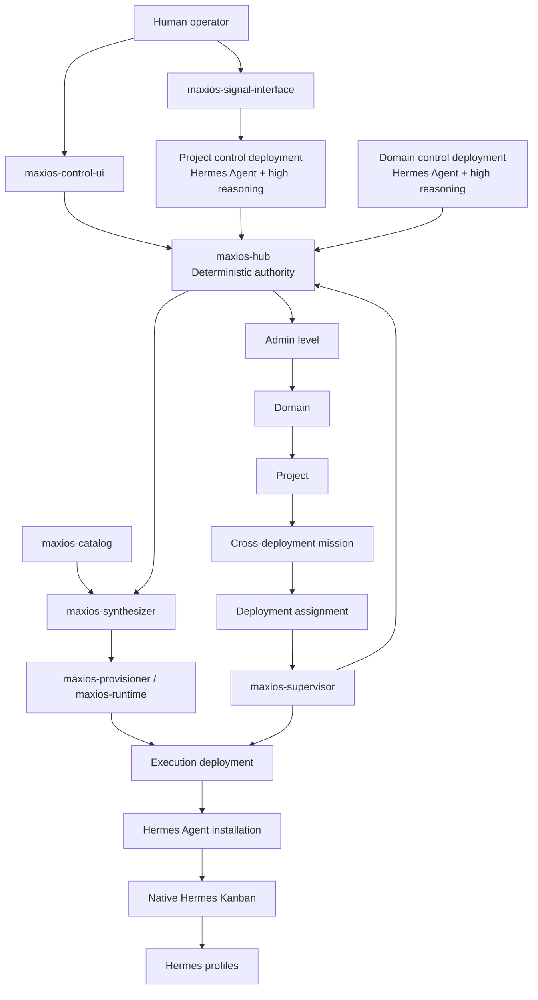

> **⚠️ Idea / Prototype — not production-grade.**
> This document was imported from `~/Documents/workspace/` as a design exploration.
> It has NOT been battle-tested. The vault's `sources/` directory remains the single
> source of truth for all production knowledge.
>
> See `sources/hermes-agent/` and `domains/architecture/` for current production
> architecture reference.

# MaxiOS Vision, Architecture, and Terminology

**Status:** Canonical foundation document  
**Version:** 0.1  
**Date:** 2026-06-18  
**Supersedes:** `MAXIOS_TERMINOLOGY_AND_NAMING_CHARTER.md`

---

## 1. Purpose of this document

This document defines the shared language for MaxiOS before implementation continues.

It has four goals:

1. summarize the MaxiOS vision;
2. explain the Hermes Agent concepts MaxiOS relies on;
3. define the MaxiOS-specific components without renaming ordinary architecture concepts;
4. establish a simple hierarchy and naming system that can be used consistently in architecture documents, repositories, code, and conversations.

.

The earlier HermesOS plugin is parked. It is not the foundation of MaxiOS. It may later be inspected for reusable deterministic code, tests, schemas, or state-machine logic, but MaxiOS is not being designed as one large Hermes Agent plugin.

---

# 2. MaxiOS in one paragraph

MaxiOS is a governed system above Hermes Agent installations.

It organizes work across the following hierarchy:

```text
Admin level
└── Domain
    └── Project
        └── Deployment
            └── Agents
```

MaxiOS researches a domain and project, synthesizes the right deployments, Hermes profiles, skills, tools, model assignments, memory policies, and task structures, and then provisions those deployments on Docker, VPS, Kubernetes, desktops, GPUs, Raspberry Pis, or other suitable hosts.

Deployments operate mostly autonomously through native Hermes Agent features such as profiles, Kanban, cron, skills, MCP, memory, gateways, and APIs.

High-reasoning models are concentrated at project, domain, and other important synthesis or diagnosis points. Cheap models and deterministic Python perform bounded execution.

Humans remain mandatory before:

1. an idea becomes an active project;
2. a project moves to the next lifecycle stage;
3. local experience becomes approved project, domain, or global knowledge.

---

# 3. Core architecture

## 3.1 Normal hierarchy terms

MaxiOS uses ordinary architecture terms for its hierarchy.

### Admin level

The top-level administrative and governance scope.

Responsibilities may include:

- global policy;
- identity and authorization;
- global provider and model policy;
- security standards;
- domain registry;
- global knowledge;
- disaster recovery;
- fleet-wide observability;
- audit and compliance.

The Admin level is not one “master agent.”

It may contain deterministic services and, later, an optional Admin control deployment using a high-reasoning Hermes Agent installation.

### Domain

A durable organizational or subject-matter area containing related projects.

Examples:

- ecommerce;
- AI infrastructure;
- healthcare;
- legal technology;
- market intelligence.

Responsibilities may include:

- continuous domain research;
- domain terminology and ontology;
- domain regulations and source maps;
- cross-project analysis;
- reusable domain knowledge;
- shared standards;
- domain-level profile, skill, and deployment recommendations.

A Domain is not a Hermes profile or Docker container.

### Project

A governed initiative with:

- an approved charter;
- a lifecycle;
- one or more deployments;
- project missions;
- project knowledge;
- budgets and constraints;
- human stage gates;
- artifacts and evidence.

A Project is not automatically one Hermes Agent installation.

A small project may use one deployment. A larger project may use separate research, code, security, operations, marketing, or ML deployments.

### Deployment

A logical, managed execution compartment belonging to a Project, Domain, or Admin scope.

A Deployment defines desired state such as:

- deployment class;
- Hermes Agent version;
- profiles;
- skills;
- MCP servers and tool policies;
- model assignments;
- memory policies;
- resource limits;
- network rules;
- secret references;
- cron jobs;
- initial missions or tasks.

A Deployment is usually realized as:

- one Docker stack;
- one VPS-based runtime;
- one Kubernetes workload;
- one workstation or GPU runtime;
- one Raspberry Pi or edge runtime.

### Deployment instance

A concrete running realization of a Deployment.

During an upgrade or recovery, one Deployment may temporarily have more than one instance.

Example:

```text
Deployment: webshop-code-production
├── instance v17-a: active
└── instance v18-b: canary
```

### Host

The physical or virtual machine running one or more deployment instances.

Examples:

- VPS;
- desktop;
- GPU workstation;
- Raspberry Pi;
- Kubernetes worker;
- bare-metal server.

---

# 4. Control deployments and execution deployments

A key MaxiOS concept is that not every Hermes Agent installation has the same role.

## 4.1 Project control deployment

A Project control deployment is a human-facing, high-reasoning Hermes Agent installation that helps operate one Project.

It may:

- communicate through Signal;
- understand project state;
- inspect all project deployments;
- synthesize project missions;
- coordinate work across deployments;
- diagnose why a deployment is producing poor results;
- request stronger models or different specialists;
- prepare stage-review packages;
- prepare knowledge candidates;
- use Codex, Claude Code, or other bounded expert tools.

It does not own authoritative project state. It acts through MaxiOS services.

Recommended default Hermes profile:

```text
default profile = project operator
```

Possible additional profiles:

- project planner;
- deployment diagnostician;
- research synthesizer;
- knowledge curator;
- architecture reviewer.

## 4.2 Domain control deployment

A Domain control deployment is a high-reasoning Hermes Agent installation for cross-project and domain-level work.

It may:

- coordinate domain research;
- compare projects;
- find recurring project failures;
- propose reusable profiles and skills;
- prepare domain knowledge candidates;
- advise on shared infrastructure;
- synthesize domain-level missions.

It should not micromanage local Hermes Kanban tasks inside project deployments.

## 4.3 Admin control deployment

An optional high-reasoning Hermes Agent installation for global analysis.

Possible responsibilities:

- fleet-wide diagnosis;
- global provider incidents;
- global security analysis;
- disaster-recovery support;
- cross-domain synthesis;
- research into Hermes Agent, models, tools, and infrastructure.

The Admin control deployment is optional. The Admin level itself must remain functional through deterministic services.

## 4.4 Execution deployment

A deployment built to perform a specific category of work.

Examples:

- research collector deployment;
- research synthesis deployment;
- code production deployment;
- security verification deployment;
- release verification deployment;
- operations deployment;
- marketing intelligence deployment;
- publishing deployment;
- data-processing deployment;
- ML/GPU deployment.

Execution deployments should be as narrow as practical.

---

# 5. Hermes Agent terminology used by MaxiOS

MaxiOS keeps Hermes Agent terminology unchanged.

## 5.1 Hermes Agent

The upstream agent harness and runtime.

Hermes Agent already provides:

- model/provider integration;
- profiles;
- tools and toolsets;
- skills;
- MCP;
- ACP;
- plugins;
- memory;
- sessions;
- native Kanban;
- cron/jobs;
- gateways and messaging;
- API server;
- dashboard;
- code execution;
- delegation;
- profile distributions.

MaxiOS builds above these capabilities rather than recreating them.

## 5.2 Hermes Agent installation

One installed Hermes Agent environment on a machine or inside a container.

An installation may contain:

- the default profile;
- named profiles;
- native Kanban boards;
- cron jobs;
- skills;
- sessions;
- memory;
- gateway processes;
- plugins;
- MCP configuration.

In MaxiOS documents, **Hermes Agent installation** and **Hermes runtime** may be used interchangeably when the meaning is clear.

## 5.3 `HERMES_HOME`

The filesystem home for a Hermes Agent profile or root installation.

It contains profile-specific configuration and state such as:

- `config.yaml`;
- `.env`;
- `SOUL.md`;
- skills;
- memory;
- sessions;
- logs;
- runtime state.

Named Hermes profiles have isolated homes.

## 5.4 Profile

A persistent Hermes Agent identity and operating environment.

A profile has its own:

- identity;
- configuration;
- model/provider settings;
- `SOUL.md`;
- memory;
- sessions;
- skills;
- MCP configuration;
- workspace and logs.

Profiles are independent runtime identities.

They do not have live inheritance from “parent” profiles.

MaxiOS may compose and compile profile specifications before deployment, but the resulting Hermes profiles are independent once installed.

## 5.5 Default profile

The root profile of a Hermes Agent installation.

For a single-purpose MaxiOS deployment, the recommended pattern is:

```text
default profile = deployment orchestrator
```

This is a recommendation, not a Hermes requirement.

The default profile should coordinate local work and use native Kanban. It should not automatically receive every implementation or infrastructure tool.

## 5.6 Orchestrator profile

A Hermes profile responsible for:

- receiving a goal;
- decomposing it;
- creating and routing Kanban tasks;
- monitoring results;
- requesting verification;
- preparing completion or escalation summaries.

Inside a MaxiOS deployment, the orchestrator is normally the default profile.

At project or domain level, a control deployment may have a scope-level operator or orchestrator profile.

## 5.7 Specialist profile

A Hermes profile designed for a bounded capability.

Examples:

- `webshop-fullstack-engineer`;
- `commerce-ux-designer`;
- `web-application-security-auditor`;
- `source-collector`;
- `research-analyst`;
- `release-verifier`.

MaxiOS prefers project-specific and capability-specific profiles over vague generic profiles such as only `coder` or `researcher`.

## 5.8 Verifier profile

A Hermes profile that independently checks:

- acceptance criteria;
- evidence;
- test results;
- security findings;
- output quality;
- compliance with constraints.

A verifier should have read-only or narrower authority than the implementer where practical.

## 5.9 `SOUL.md`

The stable identity and behavioral constitution of a Hermes profile.

It should define:

- role;
- mission;
- responsibilities;
- boundaries;
- authority;
- collaboration behavior;
- quality standards;
- escalation rules;
- actions requiring human approval.

`SOUL.md` should change less frequently than task instructions or project context.

## 5.10 Skill

A reusable Hermes operating procedure.

A skill describes how to perform a category of work and may include:

- instructions;
- scripts;
- templates;
- references;
- required tools.

Examples:

- structured web research;
- source credibility review;
- code review;
- incident diagnosis;
- evidence packaging;
- browser automation;
- memory review.

A skill is not a persistent background service and is not the same as a profile.

## 5.11 Profile distribution

A Hermes-native Git-backed package used to install or update a profile.

It may contain:

- `SOUL.md`;
- `config.yaml`;
- skills;
- cron definitions;
- `mcp.json`;
- distribution metadata.

Profile distributions should not contain secrets, sessions, or runtime memory.

MaxiOS will use profile distributions as the native output format for compiled profile designs.

## 5.12 Tool

A callable capability available to a Hermes profile.

Examples include:

- file operations;
- terminal operations;
- browser operations;
- memory;
- Kanban;
- web search;
- MCP-backed tools.

## 5.13 Toolset

A named collection of Hermes tools.

Toolsets help restrict a profile to the capabilities it needs.

Example:

```text
orchestrator profile:
- Kanban
- status
- memory
- limited project-control tools

code specialist:
- file
- terminal
- GitHub
- tests
```

## 5.14 MCP

Model Context Protocol.

Hermes Agent can connect to external MCP servers that expose tools, resources, and prompts.

MaxiOS uses MCP as a capability-integration layer for:

- GitHub;
- issue trackers;
- databases;
- browsers;
- research services;
- infrastructure APIs;
- internal company systems.

MCP is not the MaxiOS control plane and not a replacement for Kanban.

MaxiOS should apply per-profile MCP allowlists.

## 5.15 ACP

Agent Client Protocol.

Hermes Agent can run as an ACP server for editor integrations such as VS Code, Zed, or JetBrains.

MaxiOS treats ACP as an editor-facing development interface, not as the main fleet-management protocol.

## 5.16 Plugin

A Hermes Agent extension that may register:

- tools;
- hooks;
- commands;
- CLI commands;
- context injection;
- bundled skills.

The legacy HermesOS plugin is parked.

The MaxiOS foundation does not depend on building another large plugin.

Small plugins may later be used only when a capability genuinely requires in-process Hermes hooks.

## 5.17 Gateway

The persistent Hermes Agent process used for functions such as:

- messaging integrations;
- cron;
- native Kanban dispatch;
- API services;
- long-running background operation.

A headless deployment may still need a gateway even when no web dashboard or public messaging endpoint is exposed.

## 5.18 Messaging integration

Hermes Agent can connect through platforms such as Signal, Telegram, Discord, Slack, WhatsApp, email, or Microsoft Teams, depending on installed support and configuration.

MaxiOS prefers messaging at Project or Domain control deployments rather than one messaging identity for every execution deployment.

## 5.19 Kanban

Hermes Agent’s native durable task system.

MaxiOS does not replace it.

Kanban supports concepts such as:

- boards;
- tasks;
- statuses;
- dependencies;
- assigned profiles;
- task attempts;
- comments;
- attachments;
- retries;
- blocking;
- worker heartbeats;
- dispatcher-driven execution.

Kanban is local to a Hermes Agent installation.

## 5.20 Board

A native Hermes Kanban board.

A board is a local execution boundary.

MaxiOS may observe many boards centrally, but it should not mount or merge their SQLite databases.

## 5.21 Task

A native Hermes Kanban work item.

A task may contain:

- title and description;
- assignee profile;
- dependencies;
- priority;
- status;
- comments;
- attachments;
- retry policy;
- completion summary;
- structured metadata.

## 5.22 Task run or attempt

One execution attempt for a Kanban task.

Runs provide evidence such as:

- start and completion time;
- result;
- error;
- profile;
- runtime;
- completion summary;
- metadata.

## 5.23 Kanban dispatcher

The Hermes process responsible for discovering ready tasks and launching the assigned profile workers.

The dispatcher normally runs with the Hermes gateway.

## 5.24 Cron or job

Scheduled work managed by Hermes Agent.

Cron/jobs may:

- run an agent prompt;
- execute deterministic scripts;
- perform scheduled research;
- check health;
- trigger maintenance;
- deliver results through configured channels.

MaxiOS should use script-only or deterministic jobs whenever an LLM is unnecessary.

## 5.25 Session

A persisted Hermes conversation or agent interaction.

Sessions are separate from always-injected memory and can be searched or resumed.

## 5.26 Memory

Hermes profile memory provides continuity between sessions.

Memory is useful but may also contain:

- stale facts;
- mistaken conclusions;
- duplicated information;
- temporary assumptions;
- context that should not spread to other scopes.

MaxiOS never treats Hermes memory as approved organizational knowledge automatically.

## 5.27 Memory provider

The configured backend used by a Hermes profile for external or enhanced memory.

Possible options may include:

- built-in Hermes memory;
- Mnemosyne;
- MemOS;
- Memory OS;
- other supported providers.

MaxiOS chooses memory policy per profile or deployment class. It does not require one provider everywhere.

## 5.28 API server

Hermes Agent can expose an HTTP API for:

- chat completions;
- Responses-style interactions;
- long-running runs;
- run events;
- stopping runs;
- approvals;
- jobs;
- sessions;
- health and capabilities.

MaxiOS may use the API locally through a deployment supervisor.

The API should normally remain private and not be exposed publicly.

## 5.29 Dashboard

Hermes Agent includes a dashboard for local management and debugging.

MaxiOS may keep it:

- disabled in headless production;
- bound to loopback;
- accessible over WireGuard or SSH tunnel;
- temporarily enabled during development or incidents.

The Hermes dashboard is not the cross-project MaxiOS control interface.

## 5.30 `execute_code`

A Hermes capability for running deterministic Python and tool pipelines.

MaxiOS should use deterministic code heavily for:

- validation;
- collection;
- transformation;
- provisioning;
- testing;
- health checks;
- metrics;
- evidence hashing;
- deployment reconciliation.

## 5.31 Delegation or subagents

Hermes can delegate bounded reasoning work to another agent execution.

Delegation is useful for short-lived subtasks.

Durable work that must survive restarts or cross persistent profiles should use native Kanban.

## 5.32 Model and provider

A provider supplies access to one or more LLMs.

A model is the selected LLM used by a profile or task.

MaxiOS should define abstract model classes such as:

- strategic;
- reasoning;
- execution;
- extraction;
- judge.

The concrete provider/model can then be changed without redesigning the profile.

---

# 6. MaxiOS-specific software components

Only MaxiOS-specific components use the `maxios-*` naming convention.

These names describe software responsibilities. They do not replace normal words such as Project, Domain, Deployment, Profile, Task, or Memory.

The components below are conceptual boundaries. They do not all need to be separate microservices at the beginning.

## 6.1 `maxios-hub`

The deterministic central control plane.

Authoritative responsibilities:

- Admin, Domain, and Project hierarchy;
- project lifecycle;
- deployment registry;
- deployment desired state;
- cross-deployment missions;
- assignments;
- human approval records;
- audit events;
- incidents;
- approved knowledge;
- read models for dashboards and control deployments;
- authentication and authorization.

The `maxios-hub` is not an LLM and not a Hermes profile.

## 6.2 `maxios-supervisor`

A deterministic service beside each managed deployment.

Responsibilities:

- enrollment with `maxios-hub`;
- deployment health;
- Hermes gateway supervision;
- read-only Kanban observation;
- task injection;
- typed local administration commands;
- model/config application;
- desired-state reconciliation;
- backup and restore;
- incident reporting;
- secure communication over the management network.

The `maxios-supervisor` should work even when no Hermes session is active.

## 6.3 `maxios-catalog`

The private Git-backed catalog of reusable components.

May contain:

```text
profiles/
skills/
mcp-policies/
memory-policies/
model-classes/
deployment-templates/
task-templates/
evaluation-suites/
security-policies/
runtime-images/
```

The catalog is design-time source material, not live deployment state.

## 6.4 `maxios-synthesizer`

The design-time system that uses research, project requirements, and the catalog to produce:

- capability maps;
- deployment recommendations;
- profile specifications;
- profile distributions;
- skill selections;
- MCP selections;
- model assignments;
- memory policies;
- initial mission and task structures;
- evaluation plans.

It may use high-reasoning models, but outputs must be validated deterministically.

## 6.5 `maxios-provisioner`

The component that creates and updates deployment instances.

Targets may include:

- Docker;
- Docker Compose;
- VPS;
- Kubernetes;
- Raspberry Pi;
- workstations;
- GPU machines.

The hardened RunDiffusion Agents fork is a candidate starting point for this layer and its runtime packaging.

## 6.6 `maxios-control-ui`

The authenticated human operator interface.

It should provide:

- Admin → Domain → Project navigation;
- deployment inventory;
- read-only Kanban views;
- mission status;
- incidents;
- human review queues;
- model/provider changes;
- rollout and rollback;
- deployment health;
- knowledge-review workflows.

It should use `maxios-hub` as the source of truth.

## 6.7 `maxios-signal-interface`

The Signal-based human control and notification interface.

It should:

- deliver alerts;
- provide project and deployment summaries;
- accept typed commands;
- request confirmations;
- route requests to `maxios-hub`;
- keep a complete audit trail.

It should not accept arbitrary shell commands.

## 6.8 `maxios-knowledge-service`

The MaxiOS subsystem for governed knowledge.

It owns:

- observations;
- evidence packages;
- knowledge candidates;
- human promotion decisions;
- approved project knowledge;
- approved domain knowledge;
- approved global knowledge;
- revisions;
- contradictions;
- supersession;
- scoped retrieval.

This may initially be part of `maxios-hub`.

## 6.9 `maxios-gate-service`

The deterministic service enforcing human decisions.

Required gate types:

- incubation approval;
- project stage promotion;
- knowledge promotion.

An optional gate may be used for high-risk runtime changes.

This may initially be part of `maxios-hub`.

## 6.10 `maxios-audit-log`

The append-only history of:

- human actions;
- system actions;
- deployment changes;
- task injections;
- incidents;
- retries;
- model/provider changes;
- approvals;
- knowledge promotions;
- rollbacks.

This may initially be implemented as an audit module in `maxios-hub`.

## 6.11 `maxios-runtime`

The MaxiOS-maintained runtime and container packaging layer.

This is the likely name for the hardened fork derived from RunDiffusion Agents.

Responsibilities may include:

- Hermes-first container images;
- project control workbench image;
- headless Hermes image;
- process supervision;
- runtime scripts;
- persistent volumes;
- backup/restore helpers;
- local debugging tools;
- version pinning.

It is not the complete MaxiOS system.

---

# 7. MaxiOS work terminology

## 7.1 Mission

A durable objective at Admin, Domain, or Project level.

A Mission may require several deployments.

Example:

```text
Mission: release guest checkout
├── research deployment assignment
├── code deployment assignment
├── security deployment assignment
└── release-verification assignment
```

Mission state belongs to `maxios-hub`.

## 7.2 Deployment assignment

The part of a Mission assigned to one Deployment.

The `maxios-supervisor` converts an assignment into a native Hermes Kanban root task.

## 7.3 Cross-deployment mission graph

The dependency graph connecting assignments across deployments.

This belongs to MaxiOS.

## 7.4 Local task graph

The native Hermes Kanban dependency graph inside one deployment.

This belongs to Hermes Agent.

These two graphs must remain separate.

## 7.5 Evidence package

A structured result produced by a deployment.

May contain:

- artifacts;
- sources;
- tests;
- verification results;
- assumptions;
- limitations;
- confidence;
- residual risks;
- costs;
- recommended follow-up.

## 7.6 Adjustment proposal

A proposed change based on evidence.

Possible targets:

- task routing;
- profile selection;
- skill selection;
- model class;
- memory policy;
- deployment configuration;
- deployment roster;
- project organization.

Low-risk reversible adjustments may be automated within policy.

Structural or authority-changing adjustments require human review.

---

# 8. MaxiOS human gates

Humans are required at three points.

## 8.1 Incubation gate

Required before an idea becomes an active Project with provisioned resources.

Agents may perform bounded scouting before this gate, but they may not independently commit the organization to a new active project.

## 8.2 Stage-promotion gate

Required before a Project advances to its next lifecycle stage.

Example lifecycle:

```text
research
→ planning
→ architecture
→ implementation
→ testing
→ deployment
→ operations
```

Agents and deployments may work autonomously inside a stage.

They prepare a stage-review package.

A human decides whether to:

- approve;
- reject;
- request revision;
- pause;
- cancel;
- request independent review.

## 8.3 Knowledge-promotion gate

Required before local observations or memory become durable approved knowledge at a broader scope.

Example:

```text
deployment observation
→ project knowledge candidate
→ human approval
→ approved project knowledge
→ domain knowledge candidate
→ human approval
→ approved domain knowledge
```

---

# 9. Research and synthesis cycle

Research exists at every level.

```text
Admin research
→ Domain research
→ Project research
→ Deployment/task research
→ Runtime observations
```

## 9.1 Admin research

Studies:

- Hermes Agent;
- model providers;
- memory systems;
- orchestration patterns;
- infrastructure;
- security;
- external repositories;
- cost/performance.

## 9.2 Domain research

Studies:

- domain terminology;
- regulations;
- workflows;
- competitors;
- source quality;
- recurring problems;
- reusable patterns.

## 9.3 Project research

Studies:

- project goals;
- users;
- architecture;
- APIs;
- product constraints;
- technical risks;
- required capabilities;
- deployment needs.

## 9.4 Deployment and task research

Bounded research needed for one mission or implementation task.

## 9.5 Research collector deployment

A low-trust deployment that may:

- crawl;
- scrape;
- browse;
- download;
- normalize;
- hash;
- deduplicate;
- extract structured data.

It should not have production credentials or direct knowledge-promotion authority.

## 9.6 Research synthesis deployment

A cleaner deployment that receives sanitized evidence and performs:

- comparison;
- contradiction mapping;
- source-quality analysis;
- synthesis;
- gap analysis;
- project or domain implications.

## 9.7 Organization synthesis

Research should produce a capability map before profiles and deployments are created.

Example for a webshop:

```text
Required capabilities
├── ecommerce UX
├── web frontend
├── backend/API development
├── payment integration
├── automated testing
├── accessibility review
├── web security review
└── release verification
```

This may produce profiles such as:

```text
commerce-ux-designer
webshop-fullstack-engineer
payment-integration-specialist
commerce-test-engineer
web-application-security-auditor
release-verifier
```

The deployed organization should be specific to the Project.

---

# 10. Model and execution strategy

MaxiOS should not use LLMs for every operation.

Canonical execution ladder:

```text
Static rule
→ deterministic Python or service
→ small extraction/classification model
→ cheap execution model
→ high-reasoning model
→ human decision
```

## Deterministic execution

Use Python, SQL, shell, APIs, Terraform, Ansible, Kubernetes, or other deterministic tools for:

- provisioning;
- scraping with stable selectors;
- API polling;
- hashing;
- deduplication;
- schema validation;
- tests;
- health checks;
- backups;
- log parsing;
- deployment reconciliation;
- cost aggregation;
- evidence packaging.

## Cheap models

Use for:

- extraction;
- classification;
- narrow research;
- formatting;
- bounded code tasks;
- structured summarization.

## High-reasoning models

Use at important compression and decision-support points:

- Domain synthesis;
- Project organization design;
- profile and deployment synthesis;
- mission decomposition;
- architecture;
- difficult diagnosis;
- contradiction resolution;
- stage-review preparation;
- knowledge-review preparation.

High-reasoning models should normally sit in:

- Project control deployments;
- Domain control deployments;
- selected deployment orchestrators;
- explicit diagnostic or synthesis tasks.

---

# 11. Memory and knowledge cycle

MaxiOS separates runtime memory from approved knowledge.

```text
Experience
→ Hermes memory
→ observation
→ evidence package
→ knowledge candidate
→ human review
→ approved knowledge
→ downstream use
→ later correction or supersession
```

## Hermes memory

Used for continuity inside a profile or deployment.

It may be:

- automatically updated;
- local;
- fallible;
- stale;
- incomplete;
- provider-specific.

## Memory policy

A MaxiOS design-time policy applied to one profile.

Suggested policy classes:

- `ephemeral`
- `curated`
- `adaptive`

Examples:

### Ephemeral

For:

- disposable crawlers;
- independent verifiers;
- high-security profiles;
- narrow deterministic workers.

### Curated

For:

- project operators;
- domain operators;
- production operators;
- knowledge curators.

Memory writes may require review.

### Adaptive

For:

- long-running developers;
- researchers;
- support specialists;
- profiles that benefit from episodic learning.

## Observation

A structured claim extracted from research or deployment experience.

An observation is not automatically true.

## Knowledge candidate

An observation or synthesis proposed for promotion.

## Approved knowledge

Human-reviewed, versioned knowledge at:

- Project level;
- Domain level;
- Admin/global level.

## Memory hygiene

MaxiOS should monitor and periodically review:

- stale memory;
- duplicate memory;
- contradictions;
- excessive database growth;
- sensitive data;
- low-value capture;
- frequently recalled but incorrect items;
- profiles that repeatedly produce rejected outputs.

Memory cleanup should be controlled and auditable.

---

# 12. Human control and administration

## 12.1 Normal daily operation

The preferred daily interface is the Project control deployment over Signal.

Example:

```text
Human
→ Signal
→ Project control deployment
→ maxios-hub
→ target deployment supervisor
→ native Hermes Kanban
```

## 12.2 Dashboard

`maxios-control-ui` provides:

- hierarchy overview;
- deployment health;
- read-only Kanban views;
- incidents;
- pending gates;
- model/provider state;
- mission progress;
- deployment revisions.

Execution deployments may run headless.

## 12.3 SSH

SSH is break-glass administration for:

- failed supervisors;
- broken containers;
- networking issues;
- secret recovery;
- filesystem repair;
- manual restore;
- deep debugging.

SSH is not the normal MaxiOS control path.

## 12.4 Private network

The initial private management network may use WireGuard.

It connects:

- operator workstation;
- `maxios-hub`;
- control deployments;
- `maxios-supervisor` instances;
- approved administrative endpoints.

A private network does not replace authentication and authorization.

---

# 13. Deployment classes

Canonical initial deployment classes:

| Deployment class | Purpose |
|---|---|
| Project control deployment | Human-facing project reasoning and coordination |
| Domain control deployment | Domain research and cross-project synthesis |
| Admin control deployment | Optional global analysis and operations |
| Research collector deployment | Web crawling, scraping, browser automation |
| Research synthesis deployment | Clean evidence analysis and synthesis |
| Code production deployment | Software implementation and tests |
| Security verification deployment | Independent security review |
| Release verification deployment | Final acceptance and release evidence |
| Marketing intelligence deployment | Market, competitor, and audience research |
| Content production deployment | Drafting and content generation |
| Publishing deployment | Controlled publication to external systems |
| Operations deployment | Monitoring, diagnosis, and controlled remediation |
| Data-processing deployment | ETL, normalization, and batch processing |
| ML/GPU deployment | Training, inference, and evaluation |

Every Deployment should also declare:

- owning scope;
- trust zone;
- resource class;
- required capabilities;
- privilege level.

---

# 14. Recommended software and repository names

The following are proposed names, not mandatory separate repositories.

```text
maxios
    architecture, schemas, ADRs, and coordination

maxios-hub
    deterministic central control plane

maxios-runtime
    hardened RunDiffusion-derived runtime and deployment packaging

maxios-supervisor
    per-deployment deterministic supervisor

maxios-catalog
    profiles, skills, policies, templates, and evaluations

maxios-control-ui
    dashboard and human review interface

maxios-stations
    Project, Domain, and Admin control-deployment definitions

maxios-docs
    architecture and operational documentation
```

If a monorepo is used initially, these remain logical modules.

---

# 15. Parked legacy code

## Legacy HermesOS plugin

Status:

```text
parked
```

It is not part of the MaxiOS foundation.

Possible future use:

- extract workflow state-machine ideas;
- extract audit logic;
- extract tests;
- extract template-validation logic;
- extract deterministic schemas.

Do not continue adding:

- custom Kanban;
- runtime profile inheritance;
- large plugin tool surfaces;
- project lifecycle ownership inside a Hermes plugin;
- direct knowledge promotion from LLM output.

---

# 16. Canonical MaxiOS architecture



---

# 17. Core invariants

1. Hermes Agent remains the execution substrate.
2. MaxiOS does not reimplement native Hermes Kanban.
3. MaxiOS uses ordinary terms for Admin level, Domain, Project, Deployment, Profile, Mission, and Task.
4. Only MaxiOS-specific software components use `maxios-*` names.
5. `maxios-hub` is deterministic and authoritative.
6. Project and Domain control deployments use high reasoning but do not own authoritative state.
7. Each execution deployment is isolated according to risk and resources.
8. The default Hermes profile is normally the local deployment orchestrator.
9. Hermes profiles do not have live inheritance.
10. Profile composition happens before deployment through profile specifications and distributions.
11. Cross-deployment missions belong to MaxiOS.
12. Local task graphs belong to native Hermes Kanban.
13. Hermes memory is not approved knowledge.
14. Human approval is required before project incubation.
15. Human approval is required before stage promotion.
16. Human approval is required before knowledge promotion.
17. Research collector deployments are separated from secure deployments.
18. Deterministic code is preferred whenever the outcome can be specified.
19. Signal issues typed requests, not shell commands.
20. SSH remains break-glass access.
21. The Legacy HermesOS plugin remains parked unless specific deterministic parts are intentionally extracted.

---

# 18. Short canonical description

Use this text when briefing a new model or developer:

> MaxiOS is a governed system above Hermes Agent installations. It organizes work through the Admin level, Domains, Projects, and isolated Deployments. MaxiOS researches a domain and project, synthesizes the required deployment types, Hermes profiles, skills, MCP tools, model assignments, memory policies, and task structures, and provisions them through Docker, VPS, Kubernetes, workstations, GPUs, or edge devices. Native Hermes Agent profiles, Kanban, cron, gateways, skills, MCP, memory, and APIs execute local work. Project and Domain control deployments concentrate high-reasoning models for planning, synthesis, diagnosis, and coordination, while cheap models and deterministic Python handle bounded execution. `maxios-hub` owns authoritative state, `maxios-supervisor` manages each deployment, and humans remain mandatory before project incubation, lifecycle-stage promotion, and knowledge promotion.
