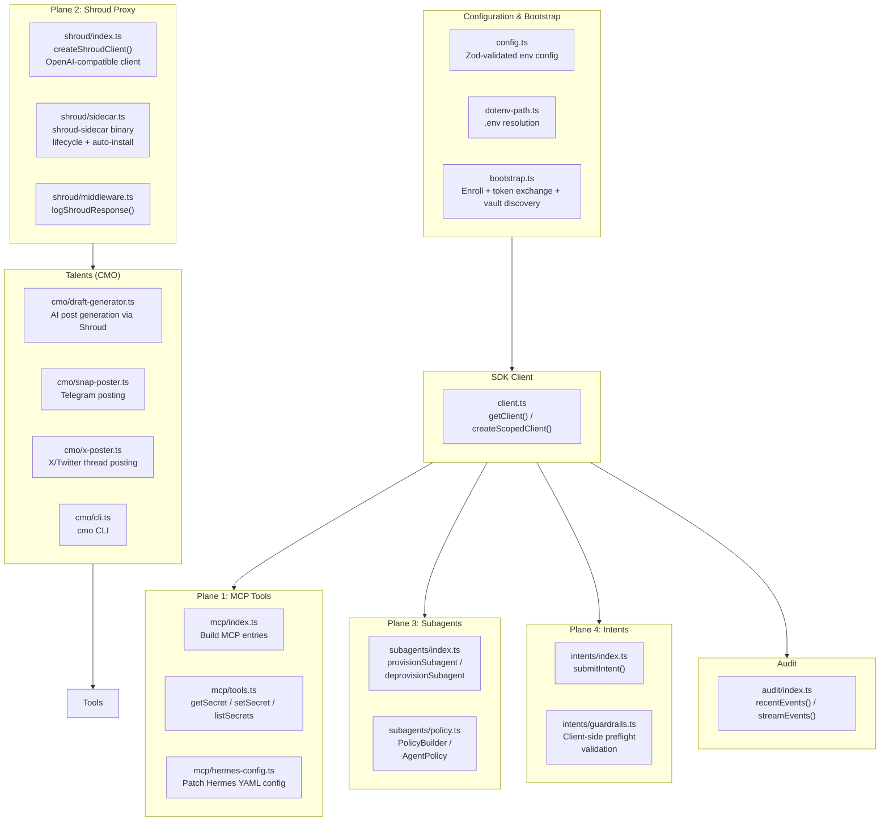

# 1claw-hermes
**Version:** 0.1.0
**Type:** TypeScript (ESM)
**Source:** `sources/1claw-hermes`

Integration package that wires [1Claw](https://1claw.xyz) secrets management into [Hermes Agent](https://hermes-agent.nousresearch.com). Operates across four planes: MCP-based secret fetching, Shroud TEE LLM proxy, per-subagent scoped identities, and Intents API transaction signing. Also contains a "CMO talent" subsystem for automated social media content generation and posting (X/Twitter and Telegram).

## Architecture Overview

The package is structured as a thin typed layer over the `@1claw/sdk` (v0.28.0), providing opinionated defaults for Hermes Agent workflows. The four core planes share a common configuration bootstrap flow and error-handling layer.



## Source Layout

```
src/
  index.ts                 — Public API re-exports (barrel)
  config.ts                — Zod-validated configuration schema
  client.ts                — 1Claw SDK client singleton + scoped factory
  bootstrap.ts             — Enrollment + API key exchange + vault discovery
  bootstrap-cli.ts         — CLI entry point (bootstrap commands)
  setup.ts                 — Unified setup: bootstrap -> MCP patch -> sidecar start
  dotenv-path.ts           — .env resolution with cwd-walking fallback
  errors.ts                — ConfigError, VaultError, GuardrailViolationError
  mcp/
    index.ts               — MCP entry builder (stdio/HTTP)
    tools.ts               — getSecret, setSecret/putSecret, listSecrets
    hermes-config.ts       — Patch/unpatch Hermes Agent config.yaml
  shroud/
    index.ts               — createShroudClient() — OpenAI-compatible proxy client
    sidecar.ts             — shroud-sidecar binary lifecycle (find, install, start, health)
    middleware.ts           — Response header inspection (redaction count, injection score)
  subagents/
    index.ts               — provisionSubagent, deprovisionSubagent, SubagentRegistry
    policy.ts              — PolicyBuilder, AgentPolicy, ephemeralReadPolicy
  intents/
    index.ts               — submitIntent() — blockchain transaction submission
    guardrails.ts          — validateIntent() — client-side preflight checks
  audit/
    index.ts               — recentEvents(), streamEvents()
  talents/
    cmo/
      index.ts             — CMO talent barrel
      cli.ts               — CLI for draft generation, Telegram posting, X posting
      draft-generator.ts   — AI draft generation via Shroud proxy
      snap-poster.ts       — Telegram (Snap) posting via Bot API
      x-poster.ts          — X/Twitter thread posting via OAuth 1.0a
      persona.md           — Brand persona (system prompt context)
      style-notes.md       — gitlawb-style posting patterns
      products.md          — Product descriptions for draft context
      campaign.md          — 30-day velocity campaign briefing
```

## Key Components

### 1. Configuration (`config.ts`)

Uses Zod schema validation with environment variable mapping. All env vars validated at startup. Only `ONECLAW_AGENT_API_KEY` (prefix `ocv_`) is strictly required; everything else has defaults or auto-discovery.

| Variable | Default | Description |
|----------|---------|-------------|
| `ONECLAW_AGENT_API_KEY` | — | Agent API key (ocv_ prefix) |
| `ONECLAW_AGENT_ID` | auto | Agent UUID from bootstrap |
| `ONECLAW_VAULT_ID` | auto | Vault UUID from bootstrap |
| `ONECLAW_API_BASE` | `https://api.1claw.xyz` | Vault API base URL |
| `ONECLAW_MCP_URL` | `https://mcp.1claw.xyz/mcp` | MCP server endpoint |
| `ONECLAW_MCP_TOKEN` | — | Pre-exchanged JWT |
| `SHROUD_URL` | `https://shroud.1claw.xyz/v1` | Shroud TEE proxy URL |
| `SHROUD_PROVIDER` | `anthropic` | Upstream LLM provider |
| `HERMES_CONFIG_DIR` | `~/.hermes` | Hermes config directory |

### 2. Bootstrap Flow (`bootstrap.ts`)

Two-phase enrollment process:

1. **Enroll** (`bootstrapEnroll`): POSTs agent name + email to `.../v1/agents/enroll`, creates a stub `.env` with an empty `ONECLAW_AGENT_API_KEY=` line.
2. **Complete** (`completeBootstrapFromEnv`): Reads `ocv_` key from `.env`, exchanges it for a JWT via `.../v1/auth/agent-token`, verifies connection via `.../v1/agents/me`, auto-discovers the vault ID, and writes a complete `.env`.

`bootstrap()` wraps both phases with TTY-aware prompting. Non-TTY mode always writes a stub and returns `pending_key`. The `ensureAgentIdInDotEnv()` helper appends `ONECLAW_AGENT_ID` to `.env` by exchanging once if missing -- required for the raw `shroud-sidecar` binary.

### 3. SDK Client (`client.ts`)

Singleton `getClient()` wraps `@1claw/sdk`'s `createClient()` with auto-refreshing JWT authentication. `createScopedClient(token)` creates a scoped client for subagent operation.

### 4. MCP Tools (`mcp/tools.ts`)

Three vault operations exposed as typed functions mirroring MCP tool names:

- **`getSecret(path, ctx?)`** -- reads a secret value from the vault
- **`setSecret(path, value, opts?)`** / **`putSecret(path, value, opts?)`** -- writes a secret; `putSecret` is an alias matching MCP wire name
- **`listSecrets(prefix, ctx?)`** -- lists secret paths matching a prefix

All accept an optional `AgentContext` (subagent agentId + token) for scoped access. Error formatting includes HTTP status, error type, and detail message.

### 5. Hermes Config Patching (`mcp/hermes-config.ts`)

Mutates `~/.hermes/config.yaml` (or `config.json`) to add a `mcp_servers.oneclaw` entry. Two transport modes:

- **stdio** (default): runs `npx -y @1claw/mcp` with env-based `ocv_` auth; JWT refreshes inside the MCP process on every tool call, avoiding stale Bearer tokens in YAML.
- **http**: targets `mcp.1claw.xyz` with a short-lived Bearer JWT.

Also patches `model.provider = "custom"` / `model.base_url` to route Hermes LLM calls through the Shroud sidecar.

### 6. Shroud TEE Proxy

Two access modes:

**Programmatic (`shroud/index.ts`):** `createShroudClient()` returns an OpenAI-compatible client pointed at Shroud (`https://shroud.1claw.xyz/v1`). Sends `X-Shroud-Provider` header to select upstream. Shroud intercepts requests to redact secrets/PII, score for prompt injection, then forward to the provider.

**Sidecar binary (`shroud/sidecar.ts`):** `shroud-sidecar` is a standalone binary that acts as a local LLM proxy. `startSidecar()` finds or auto-installs the binary via install.sh, passes credentials as env vars, and spawns it. `startSidecarAndWait()` additionally polls `/healthz` up to 15 seconds. Supports CLI mode (`pnpm shroud`) with `--env-file` and `--provider` options.

The **setup script** (`src/setup.ts`) automates the full chain: bootstrap verification -> MCP config patch -> model config patch -> sidecar install + start.

**Middleware (`shroud/middleware.ts`):** `logShroudResponse()` parses `x-shroud-redacted-count` and `x-shroud-injection-score` response headers, logging warnings for scores above 0.7.

### 7. Subagents (`subagents/`)

Ephemeral agent identities with scoped vault access:

- **`provisionSubagent(name, policy, registry)`**: Creates a subagent via the 1Claw API with configurable auth method (`api_key`), TTL, vault scope, transaction signing chains, and EIP-712 domain allowlists. Grants secret access via `access.grantAgent()`. Exchanges the subagent API key for a JWT. Registers in `SubagentRegistry`.
- **`deprovisionSubagent(agentId, registry)`**: Revokes all grants for the agent, deletes the agent, removes from registry.
- **`SubagentRegistry`**: In-memory map of live subagents, with `revokeAll()` cleanup on process SIGTERM/SIGINT.
- **`PolicyBuilder`**: Builder pattern for constructing `AgentPolicy` objects with path globs, permissions (read/write), TTL, value caps, chain allowlists, address allowlists, signing chains, EIP-712 config.
- **`ephemeralReadPolicy(path)`**: Pre-built read-only policy with 5-minute TTL.

### 8. Intents (`intents/`)

Blockchain transaction submission and validation:

- **`submitIntent(agentId, intent)`**: Submits a transaction (to, value, chain, data) via the 1Claw API. Always simulates first. Returns tx hash, chain, explorer URL.
- **`validateIntent(intent, policy)`**: Client-side preflight checks -- chain allowlist, value cap, address allowlist. Throws `GuardrailViolationError` with machine-readable code (`CHAIN_NOT_ALLOWED`, `VALUE_EXCEEDS_CAP`, `ADDRESS_NOT_ALLOWED`). The Vault API enforces the same constraints server-side.

Explorer URL mapping covers ethereum, base, optimism, arbitrum, polygon, sepolia, and base-sepolia.

### 9. Audit (`audit/index.ts`)

- **`recentEvents(limit)`**: Fetches the most recent audit events from the vault.
- **`streamEvents(since?)`**: AsyncGenerator that pages through all audit events, yielding normalized `AuditEvent` objects with timestamp, agentId, action, path, and outcome (success/denied).

### 10. CMO Talent (`talents/cmo/`)

A complete social media publishing subsystem for the `@1clawai` X account and Telegram channels. Runs through Shroud's TEE proxy for LLM draft generation so no plaintext secrets leak into generated content.

**Draft generation (`draft-generator.ts`):**
- Generates 1-12 candidate X posts using Shroud (default model: `claude-sonnet-4-20250514`, temperature 0.85).
- 26 post formats grouped into gitlawb-style (newsdrop, stats, qt, milestone, release, dogfood, poll, shoutout, rally, thread, journal-cta, ugc-repost) and 1clawai/Bankr-ecosystem (holder-milestone, onchain-stats, listing-news, reference-demo, editorial-coverage, ecosystem-partner, essay, stack-diagram, bankr-amplified, auto).
- System prompt built from four briefing documents: `persona.md`, `style-notes.md`, `products.md`, `campaign.md`.
- Uses placeholder markers (`{{stat:stars}}`, `{{stat:holders}}`, `{{version}}`, etc.) for values the user fills.

**Telegram posting (`snap-poster.ts`):**
- Sends messages to Telegram channels via Bot API.
- Credentials fetched from 1Claw vault (`telegram/snap-bot-token`, `telegram/channels` JSON map).
- Overridable via env vars (`SNAP_BOT_TOKEN`, `SNAP_CHANNEL_MAP_JSON`).
- Dry-run by default. Supports MarkdownV2 (with custom escape), Markdown, HTML, or none.
- `resolveChannel(slug)` looks up channel slug in vault-stored JSON map.
- `toMarkdownV2()` converts common Markdown to Telegram MarkdownV2 escaping.

**X/Twitter posting (`x-poster.ts`):**
- Posts single tweets or threaded reply-chains via OAuth 1.0a.
- Credentials from vault (`x/1clawai-oauth1` JSON blob) or env overrides (`X_OAUTH1_JSON`, individual `X_API_KEY` etc.).
- Supports media upload (up to 4 per tweet) from local file paths.
- `fetchQuoteTweets(anchorId, opts)` lists quote-tweets of a given anchor tweet for "boost mode" workflows.
- Dependency injection (`XDeps`) for testability -- tests swap in fake clients without network calls.

**Briefing documents** (loaded as system prompt context):
- `persona.md` -- Brand voice: confident, low-ego, declarative. Coined lexicon: "agentic security era", "vault-native", "tool-call inspected", "shrouded". Core themes: prompt injection, JIT secrets, agent identity, open audit, TEE inspection.
- `style-notes.md` -- 13 posting patterns extracted from @gitlawb's playbook: QT-hijacks, stats brags, milestones, release notes, dogfooding, polls, shoutouts, threaded theses, journal CTAs, single-word rallies, founder reposts, UGC reposts. Translation table to @1clawai equivalents.
- `products.md` -- Product context: 1claw-mcp repo, killer claims, deployment modes, tool inventory.
- `campaign.md` -- 4-week velocity campaign: Week 1 (reference agent), Week 2 (outreach + ecosystem), Week 3 (distribution + volume), Week 4 (manufactured inflection). Bankr backing confirmed. Token-specific formats. QT-hijack targets.

**CLI (`cli.ts`):** Commands: `draft`, `post`, `channel`, `x`, `quotes`. All default to dry-run; pass `--send` to fire.

### 11. Error Types (`errors.ts`)

- **`ConfigError`**: Configuration validation failures
- **`VaultError`**: API errors with machine-readable code (e.g. `SECRET_WRITE_FAILED`, `ENROLL_FAILED`, `SUBAGENT_CREATE_FAILED`)
- **`GuardrailViolationError`**: Client-side intent validation failures with codes `CHAIN_NOT_ALLOWED`, `VALUE_EXCEEDS_CAP`, `ADDRESS_NOT_ALLOWED`

## Setup Script (`pnpm setup`)

The `src/setup.ts` entry point (`pnpm setup`) automates a complete agent workspace configuration:

1. Checks bootstrap credentials from `.env`
2. Runs `completeBootstrapFromEnv` if vault ID missing
3. Ensures `ONECLAW_AGENT_ID` in `.env`
4. Patches Hermes MCP config via `patchHermesConfig()` (stdio transport)
5. Patches Hermes model config to use local sidecar (`patchHermesModel()`)
6. Installs and starts `shroud-sidecar` binary, waits for health check (unless `--no-sidecar`)

Supports overrides: `--provider`, `--model`, `--hermes-dir`, `--env-path`, `--sidecar-port`.

## Dependencies

| Package | Purpose |
|---------|---------|
| `@1claw/sdk` ^0.28.0 | 1Claw vault API client |
| `openai` ^4.0.0 | OpenAI-compatible client (Shroud proxy) |
| `twitter-api-v2` ^1.29.0 | X/Twitter API v2 client |
| `yaml` ^2.6.0 | YAML parsing (Hermes config) |
| `zod` ^3.22.0 | Runtime config validation |

## Tests

## Related

- [[hermes-agent]] — Parent project for secrets integration
- [[mcp]] — MCP protocol for secrets vault integration


All test files in `test/`:

| Test file | Coverage |
|-----------|----------|
| `bootstrap.test.ts` | Needs-bootstrap detection, env parsing, full bootstrap flow, non-TTY stub, enrollment failure |
| `dotenv-path.test.ts` | Env path resolution with explicit path, cwd walk, parent walk |
| `mcp-tools.test.ts` | setSecret/putSecret SDK forwarding, error formatting |
| `shroud.test.ts` | Sidecar and middleware behavior |
| `subagents.test.ts` | Provisioning, deprovisioning, registry lifecycle |
| `mcp.test.ts` | MCP entry building (stdio/HTTP) |
| `intents.test.ts` | Intent submission and guardrail validation |
| `x-poster.test.ts` | X post thread (dry-run and real), quote tweet fetch |
| `snap-poster.test.ts` | Telegram posts, channel resolution, MarkdownV2 conversion |
| `cmo.test.ts` | Draft generation and CLI parsing |
