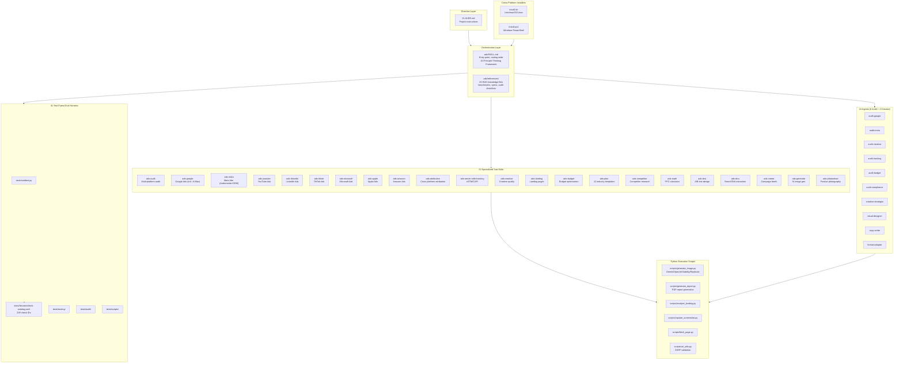

# claude-ads

**Version:** v1.7.1
**Type:** Agent Skill (Agent Skills Tier 4 — Directive / Orchestration / Execution)
**License:** MIT
**Source:** `sources/claude-ads`
**GitHub:** [AgriciDaniel/claude-ads](https://github.com/AgriciDaniel/claude-ads)

Claude Ads is a Tier 4 Agent Skills-compatible skill for comprehensive paid advertising analysis across all major platforms. Purpose-built for **PPC agencies, in-house marketers, and freelance ad consultants**. A single manual audit of a Google Ads account takes 4-6 hours of senior PPC time; Claude Ads runs the same audit in 10-15 minutes, scoring accounts on a 0-100 weighted scale across eight ad platforms with a prioritized action plan.

The skill follows the **Agent Skills open standard** with a 3-layer architecture: directive (CLAUDE.md), orchestration (ads/SKILL.md), and execution (skills/ads-* sub-skills and agents/). Covers Google, Meta, YouTube, LinkedIn, TikTok, Microsoft, Apple, and Amazon Ads with 250+ weighted audit checks, plus cross-platform attribution (AdAttributionKit, GA4, Consent Mode V2) and server-side tracking (sGTM, CAPI Gateway) deep dives.

## Architecture Overview



## Source Layout

```
claude-ads/
  CLAUDE.md                                 # Project instructions (directive layer)
  ads/SKILL.md                              # Orchestrator — entry point, routing, core rules
  ads/references/                           # 26 RAG reference files (benchmarks, specs, checklists)
  skills/                                   # 22 specialized sub-skills
    ads-audit/SKILL.md                     # Full multi-platform audit
    ads-google/SKILL.md                    # Google Ads (Search, PMax, AI Max)
    ads-meta/SKILL.md                      # Meta Ads (Andromeda + GEM + Lattice)
    ads-youtube/SKILL.md                   # YouTube Ads (Demand Gen, Shorts, CTV)
    ads-linkedin/SKILL.md                  # LinkedIn Ads
    ads-tiktok/SKILL.md                    # TikTok Ads (post-USDS)
    ads-microsoft/SKILL.md                 # Microsoft/Bing Ads
    ads-apple/SKILL.md                     # Apple Ads (AdAttributionKit)
    ads-amazon/SKILL.md                    # Amazon Ads (Wave 2)
    ads-attribution/SKILL.md               # Cross-platform attribution (Wave 2)
    ads-server-side-tracking/SKILL.md      # sGTM, CAPI Gateway (Wave 2)
    ads-creative/SKILL.md                  # Creative quality + Entity-ID scoring
    ads-landing/SKILL.md                   # Landing page analysis
    ads-budget/SKILL.md                    # Budget allocation optimization
    ads-plan/SKILL.md                      # Strategic ad planning
    ads-plan/assets/                       # 12 industry templates
    ads-competitor/SKILL.md                # Competitor research
    ads-math/SKILL.md                      # PPC financial calculator
    ads-test/SKILL.md                      # A/B test design
    ads-dna/SKILL.md                       # Brand DNA extraction
    ads-create/SKILL.md                    # Campaign concepts and copy briefs
    ads-generate/SKILL.md                  # AI ad image generation
    ads-photoshoot/SKILL.md               # Product photography (5 styles)
  agents/                                   # 10 agents (6 audit + 4 creative)
    audit-google.md                        # Google Ads audit agent
    audit-meta.md                          # Meta Ads audit agent
    audit-creative.md                      # Creative quality agent
    audit-tracking.md                      # Conversion tracking agent
    audit-budget.md                        # Budget analysis agent
    audit-compliance.md                    # Compliance verification agent
    creative-strategist.md                 # Campaign concept strategist
    visual-designer.md                     # AI image generation orchestrator
    copy-writer.md                         # Headlines, CTAs, primary text
    format-adapter.md                      # Asset dimension validation
  scripts/                                  # Python execution scripts
    generate_image.py                      # Multi-provider AI image generation
    generate_report.py                     # PDF audit report generation
    analyze_landing.py                     # Landing page analysis
    capture_screenshot.py                  # Screenshot capture
    fetch_page.py                          # Page fetching utility
    url_utils.py                           # URL validation and SSRF protection
  tests/                                    # 41-test pytest eval harness
    conftest.py                            # Shared fixtures
    fixtures/check-catalog.yaml            # 209-check canonical catalog
    routing/                               # Trigger → skill snapshot tests
    audit/                                 # Catalog coverage + scoring math
    scripts/                               # SSRF + sanitize_error tests
  evals/                                    # Evaluation data
    creative-evals.json                    # Creative evaluation benchmarks
  install.sh                               # Unix/macOS/Linux installer
  install.ps1                              # Windows PowerShell installer
  uninstall.sh                             # Unix uninstaller
  uninstall.ps1                            # Windows uninstaller
  assets/                                  # Brand assets, diagrams, banners
```

## Key Sub-Skill Categories

### Audit & Platform-Specific
| Sub-skill | Platform | Focus |
|-----------|----------|-------|
| `ads-audit` | Cross-platform | Full multi-platform audit, parallel subagent dispatch |
| `ads-google` | Google Ads | Search, PMax, AI Max (`ai_max_setting`, AI Brief, FUE), Demand Gen, CTV, YouTube — 80 checks |
| `ads-meta` | Meta Ads | Facebook, Instagram, Threads, Advantage+, Andromeda + GEM + Lattice, Entity-ID clustering — 50 checks |
| `ads-youtube` | YouTube | Skippable, Shorts, Demand Gen, CTV |
| `ads-linkedin` | LinkedIn | B2B targeting, TLA, Lead Gen, CRM integration — 27 checks |
| `ads-tiktok` | TikTok | Creative-first, Smart+, GMV Max, Search Ads, Events API — 28 checks |
| `ads-microsoft` | Microsoft/Bing | Google import validation, Copilot, CTV, LinkedIn targeting — 24 checks |
| `ads-apple` | Apple Ads | Campaign structure, CPPs, Maximize Conversions, AdAttributionKit — 35+ checks |
| `ads-amazon` | Amazon Ads | Sponsored Products / Brands / Display, ACOS/TACOS — 30+ checks (Wave 2) |

### Cross-Platform / Strategic
| Sub-skill | Purpose |
|-----------|---------|
| `ads-attribution` | Cross-platform attribution audit (AdAttributionKit, GA4, Consent Mode V2, MMP) — Wave 2 |
| `ads-server-side-tracking` | Server-side tracking pipeline audit (sGTM, CAPI Gateway, dedup, hashing) — Wave 2 |
| `ads-creative` | Creative quality and fatigue assessment with Andromeda Entity-ID retrieval scoring |
| `ads-landing` | Landing page conversion analysis |
| `ads-budget` | Budget allocation optimization and bidding strategy review |
| `ads-plan` | Strategic ad planning with 12 industry templates |

### Creative Pipeline
| Sub-skill | Domain |
|-----------|--------|
| `ads-dna` | Brand DNA extraction from website → `brand-profile.json` |
| `ads-create` | Campaign concepts and copy briefs → `campaign-brief.md` |
| `ads-generate` | AI ad image generation with pluggable providers (Gemini, OpenAI, Stability, Replicate) |
| `ads-photoshoot` | Product photography in 5 professional styles |

### Analytics & Research
| Sub-skill | Domain |
|-----------|--------|
| `ads-math` | PPC financial calculator (CPA, ROAS, break-even, LTV:CAC, budget forecasting) |
| `ads-test` | A/B test design (hypothesis framework, significance, sample size, duration) |
| `ads-competitor` | Competitor ad intelligence across all platforms |

## 10-Principle Thinking Framework

Every audit, plan, and creative output runs under a shared cognitive discipline defined in `ads/references/thinking-framework.md`. The framework clusters in five pairs:

| # | Principle | In ads work | Anti-pattern |
|---|-----------|-------------|--------------|
| 1 | **OBSERVE — External** | Collect actual account data before diagnosing | Diagnosing from memory before opening the account |
| 2 | **OBSERVE — Internal** | Audit your own biases and assumptions | Applying B2B heuristics to a plumber |
| 3 | **LISTEN** | Absorb client brief, platform guidance, community signals | Telling brand-awareness clients to optimize for ROAS |
| 4 | **THINK** | First-principles math: compute unit economics by hand | Copying best practices without checking prerequisites |
| 5 | **CONNECT — Lateral** | Link unrelated concepts (Andromeda + Entity-ID + GEM) | Siloed platform audits missing cross-platform leverage |
| 6 | **CONNECT — System** | Orchestrate creative pipeline: dna → create → generate → photoshoot | Fixes that conflict with each other |
| 7 | **FEEL** | Emotional resonance of messaging, intuition | Scoring compliance but ignoring emotional flatness |
| 8 | **ACCEPT** | Kill rules (3× CPA = campaign is dead), sunk cost | Defending best practices when history shows failure |
| 9 | **CREATE** | Ship the deliverable, generate assets, render PDF | Endless "more analysis needed" loops |
| 10 | **GROW** | Measurement plan, re-audit cycle, track trajectory | One-shot audits with no follow-up |

## Cross-Runtime Install Support

The skill ships with an `install.sh` / `install.ps1` dual-installer supporting six CLI hosts:

| Target | Status | Skill Root | Agent Root |
|--------|--------|------------|------------|
| `claude` | ✅ Verified (GA) | `~/.claude/skills/` | `~/.claude/agents/` |
| `codex` | 🟡 Experimental | `~/.codex/skills/` | `~/.codex/agents/` |
| `cursor` | 🟡 Experimental | `~/.cursor/extensions/claude-ads/skills/` | `~/.cursor/extensions/claude-ads/agents/` |
| `windsurf` | 🟡 Experimental | `~/.windsurf/skills/` | `~/.windsurf/agents/` |
| `gemini` | 🟡 Experimental | `~/.gemini/extensions/claude-ads/skills/` | `~/.gemini/extensions/claude-ads/agents/` |
| `goose` | 🟡 Experimental | `~/.config/goose/skills/` | `~/.config/goose/agents/` |

Target and path override validation uses strict whitelisting — no shell injection, no flag confusion, no `..` segments, no UNC paths. Python dependencies install automatically for Claude Code and Codex CLI targets; skipped for IDE targets (Cursor, Windsurf, Gemini, Goose).

## Key Files

| File | Purpose |
|------|---------|
| `CLAUDE.md` | Project instructions, directory structure, command reference, development rules |
| `ads/SKILL.md` | Orchestrator — routing table, context intake, quality gates, scoring methodology, community footer |
| `ads/references/thinking-framework.md` | 10-Principle Thinking Framework (291 lines) |
| `ads/references/scoring-system.md` | Weighted scoring algorithm and grading thresholds |
| `ads/references/benchmarks.md` | Industry benchmarks by platform (CPC, CTR, CVR, ROAS) |
| `ads/references/google-audit.md` | 80-check Google Ads audit checklist (G01-G61 + 19 hyphenated checks) |
| `ads/references/meta-audit.md` | 50-check Meta Ads audit checklist (M01-M40 + 10 checks) |
| `ads/references/linkedin-audit.md` | 27-check LinkedIn Ads audit checklist |
| `ads/references/tiktok-audit.md` | 28-check TikTok Ads audit checklist |
| `ads/references/microsoft-audit.md` | 24-check Microsoft Ads audit checklist |
| `scripts/generate_image.py` | Multi-provider AI image generation (Gemini, OpenAI, Stability AI, Replicate) — 591 lines |
| `scripts/generate_report.py` | Professional PDF audit report generation with ReportLab + Matplotlib — 752 lines |
| `tests/conftest.py` | Shared pytest fixtures — 81 lines |
| `tests/fixtures/check-catalog.yaml` | 209-check canonical catalog — 277 lines |
| `install.sh` | Unix/macOS/Linux cross-host installer — 314 lines |
| `install.ps1` | Windows PowerShell cross-host installer |

## Features

- **Multi-platform audit**: 250+ weighted checks across Google (80), Meta (50), LinkedIn (27), TikTok (28), Microsoft (24), Apple (35+), Amazon (30+), plus cross-platform
- **Ads Health Score (0-100)**: Weighted scoring algorithm with severity multipliers (critical 5.0×, high 3.0×, medium 1.5×, low 0.5×)
- **PDF report generation**: `scripts/generate_report.py` produces client-ready PDFs with health score gauge, platform bar charts, pass/fail distribution, formatted tables, zero-overlap layout
- **AI ad image generation**: `scripts/generate_image.py` with pluggable providers — Gemini (default), OpenAI, Stability AI, Replicate. Supports aspect ratios, batch processing, style reference images
- **Brand DNA extraction**: `/ads dna <url>` analyzes website content and outputs `brand-profile.json` for downstream creative generation
- **A/B test design**: Hypothesis framework, significance calculation, sample size and duration estimation
- **Budget optimization**: Platform selection matrix, scaling rules, MER analysis, 3× Kill Rule enforcement
- **12 industry templates**: SaaS, E-commerce, Local Service, B2B Enterprise, Info Products, Mobile App, Real Estate, Healthcare, Finance, Agency, Marketplace Seller, and Generic
- **10 parallel subagents**: 6 audit agents + 4 creative agents dispatched via Task tool with `context: fork`
- **10-Principle Thinking Framework**: Shared cognitive discipline across all analysis and creative output
- **209-check bidirectional catalog**: Every check ID verified between `tests/fixtures/check-catalog.yaml` and audit reference files; drift triggers CI failure
- **41-test pytest eval harness**: Routing snapshots, catalog coverage, scoring math determinism, SSRF regression suite
- **SSRF protection**: `scripts/url_utils.py` validates URLs against 27 IPv4/IPv6 blocklist cases, non-HTTP scheme blocks, DNS fail-closed
- **Quality gates**: 10 hard rules enforced during every audit (never recommend Broad Match without Smart Bidding, 3× Kill Rule, budget sufficiency, learning phase protection, compliance, Andromeda creative diversity, privacy infrastructure gate, PDF report quality gate)
- **Creative pipeline**: `/ads dna` → `/ads create` → `/ads generate` → `/ads photoshoot`, each step independently runnable

## Related

- [[skills]] — Broader Agent Skills ecosystem
- [[hermes-agent]] — MCP hub with 49 tools (complementary: Claude Ads provides analysis, Hermes provides MCP tool access)
- [[claude-seo]] — Companion SEO analysis skill by the same author

## Eval Harness

The eval harness comprises **41 tests** across four categories:

| Test area | Coverage |
|-----------|----------|
| `tests/routing/` | Every documented trigger phrase routes to its expected sub-skill |
| `tests/audit/test_check_coverage.py` | Bidirectional check between check-catalog.yaml (209 IDs) and audit reference files; no orphan IDs, no untracked rows |
| `tests/audit/test_scoring_math.py` | Re-implements weighted-score algorithm; asserts determinism across 10 runs and correct severity weighting |
| `tests/scripts/test_url_utils.py` | SSRF regression — 27 IPv4/IPv6 blocklist cases, non-HTTP scheme blocks, DNS fail-closed, credential redaction |
