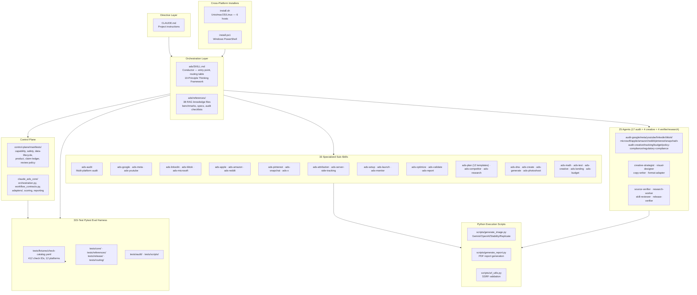

# claude-ads

**Version:** v2.0.1
**Type:** Agent Skill (Agent Skills Tier 4 — Directive / Orchestration / Execution)
**License:** MIT
**Source:** `sources/claude-ads`
**GitHub:** [AgriciDaniel/claude-ads](https://github.com/AgriciDaniel/claude-ads) (public) · `AI-Marketing-Hub/claude-ads` (community mirror)

Claude Ads is a Tier 4 Agent Skills-compatible skill for comprehensive paid advertising analysis across all major platforms. Purpose-built for **PPC agencies, in-house marketers, and freelance ad consultants**. A single manual audit of a Google Ads account takes 4-6 hours of senior PPC time; Claude Ads runs the same audit in 10-15 minutes, scoring accounts on a 0-100 weighted scale across twelve ad platforms with a prioritized action plan.

The skill follows the **Agent Skills open standard** with a 3-layer architecture: directive (CLAUDE.md), orchestration (ads/SKILL.md), and execution (skills/ads-* sub-skills and agents/). v2.0 added a **control plane** (capability/safety/data-lifecycle manifests, claim ledger, review policy) and a **deterministic Python core** (`claude_ads_core/`) implementing a conductor→bounded-worker model. Covers Google, Meta, YouTube, LinkedIn, TikTok, Microsoft, Apple, Amazon, Reddit, Pinterest, Snapchat, and X Ads with 412 weighted audit checks, plus cross-platform attribution (AdAttributionKit, GA4, Consent Mode V2) and server-side tracking (sGTM, CAPI Gateway) deep dives.

## Architecture Overview



## Source Layout

```
claude-ads/
  CLAUDE.md                                 # Project instructions (directive layer)
  ads/SKILL.md                              # Orchestrator — conductor entry point, routing, core rules
  ads/references/                           # 38 RAG reference files (benchmarks, specs, checklists)
  control-plane/                            # Public-safe contract layer (v2)
    README.md                               # Control-plane doctrine & contract index
    PRODUCT_BOUNDARIES.md                   # Buyer, promise, supported workflows, non-promises
    PUBLISHING_POLICY.md                    # Private/public classification + publication gate
    RELEASE_REQUIREMENTS.md                 # Maturity, testing, security, packaging gates
    manifests/                              # 20 JSON manifests (capability, safety, data-lifecycle,
                                            #   product, claim-ledger, control-registry, scoring-profiles,
                                            #   orchestration-policy, review-policy, source-ledger, ...)
    schemas/                                # JSON Schema Draft 2020-12 contracts (24 files)
  claude_ads_core/                          # Deterministic Python package (v2)
    orchestration.py                        # Immutable file-backed orchestration packets + artifact gates
    workflow_contracts.py                   # Strict dependency-free workflow/orchestration validators
    adapters/                               # csv_export, native_export, mappings_v1, base
    control_registry.py                     # Typed control registry / fail-closed health state
    scoring.py · reporting.py · product_status.py · contracts.py · models.py · cli.py
    schemas/v1/                             # Versioned JSON schemas (22 files)
  skills/                                   # 33 specialized sub-skills
    ads-audit/SKILL.md                     # Full multi-platform audit
    ads-google/SKILL.md                    # Google Ads (Search, PMax, AI Max)
    ads-meta/SKILL.md                      # Meta Ads (Andromeda + GEM + Lattice)
    ads-youtube/SKILL.md                   # YouTube Ads (Demand Gen, Shorts, CTV)
    ads-linkedin/SKILL.md                  # LinkedIn Ads
    ads-tiktok/SKILL.md                    # TikTok Ads (post-USDS)
    ads-microsoft/SKILL.md                 # Microsoft/Bing Ads
    ads-apple/SKILL.md                     # Apple Ads (AdAttributionKit)
    ads-amazon/SKILL.md                    # Amazon Ads (Wave 2)
    ads-reddit/SKILL.md                    # Reddit Ads (Wave 2)
    ads-pinterest/SKILL.md                 # Pinterest Ads (Wave 2)
    ads-snapchat/SKILL.md                  # Snapchat Ads (Wave 2)
    ads-x/SKILL.md                         # X/Twitter Ads (Wave 2)
    ads-attribution/SKILL.md               # Cross-platform attribution
    ads-server-side-tracking/SKILL.md      # sGTM, CAPI Gateway
    ads-setup/SKILL.md                     # Client/brand/account setup profiles
    ads-launch/SKILL.md                    # Campaign launch via capability-gated adapters
    ads-monitor/SKILL.md                   # Pacing, delivery, anomaly monitoring
    ads-optimize/SKILL.md                  # Evidence-based optimization, budget/bid changes
    ads-validate/SKILL.md                  # Contract/scoring/release validation + status
    ads-report/SKILL.md                    # Markdown/HTML/PDF report rendering from run bundles
    ads-research/SKILL.md                  # Evidence refresh (API/policy/benchmark claims)
    ads-creative/SKILL.md                  # Creative quality + Entity-ID scoring
    ads-landing/SKILL.md                   # Landing page analysis
    ads-budget/SKILL.md                    # Budget allocation optimization
    ads-plan/SKILL.md                      # Strategic ad planning
    ads-plan/assets/                       # 12 industry templates
    ads-competitor/SKILL.md                # Competitor research
    ads-math/SKILL.md                      # PPC financial calculator
    ads-test/SKILL.md                      # A/B test design
    ads-dna/SKILL.md                       # Brand DNA extraction
    ads-create/SKILL.md                    # Campaign concepts and copy briefs
    ads-generate/SKILL.md                  # AI ad image generation
    ads-photoshoot/SKILL.md               # Product photography (5 styles)
  agents/                                   # 25 agents (17 audit + 4 creative + 4 verifier/research)
    audit-google.md / audit-meta.md / audit-youtube.md    # Platform audit agents
    audit-linkedin.md / audit-tiktok.md / audit-microsoft.md
    audit-apple.md / audit-amazon.md / audit-reddit.md
    audit-pinterest.md / audit-snapchat.md / audit-x.md
    audit-creative.md / audit-tracking.md / audit-budget.md
    audit-policy-compliance.md / audit-regulatory-compliance.md
    creative-strategist.md / visual-designer.md / copy-writer.md / format-adapter.md
    source-verifier.md / research-worker.md / skill-reviewer.md / release-verifier.md
  scripts/                                  # Python execution scripts
    generate_image.py                      # Multi-provider AI image generation
    generate_report.py                     # PDF audit report generation
    analyze_landing.py                     # Landing page analysis
    capture_screenshot.py                  # Screenshot capture
    fetch_page.py                          # Page fetching utility
    url_utils.py                           # URL validation and SSRF protection
  tests/                                    # 315-test pytest eval harness
    conftest.py                            # Shared fixtures
    fixtures/check-catalog.yaml            # 412-check canonical catalog (version 2.0, 12 platforms)
    audit/                                 # Catalog coverage + scoring math + source grounding
    core/                                  # Adapters, contracts, control registry, scoring engine
    references/                            # Cross-platform reference consistency
    release/                               # Release gates + repository review ledger
    routing/                               # Trigger → skill snapshots + model eval gate
    scripts/                               # SSRF, installer security, privacy outputs
  evals/                                    # Model-facing evaluation data
    v2-behavior-evals.json                 # Behavior evals (safety P0/P1, partial audits)
    model-eval-contract.json               # Model eval gate contract
    model_eval_gate.py                     # Fail-closed canonical model-eval gate
    creative-evals.json                    # Creative evaluation benchmarks
  install.sh                               # Unix/macOS/Linux installer (6 hosts)
  install.ps1                              # Windows PowerShell installer
  uninstall.sh                             # Unix uninstaller
  uninstall.ps1                            # Windows uninstaller
  assets/                                  # Brand assets, diagrams, banners
```

## Key Sub-Skill Categories

### Audit & Platform-Specific
| Sub-skill | Platform | Focus |
|-----------|----------|-------|
| `ads-audit` | Cross-platform | Full multi-platform audit, parallel subagent dispatch |
| `ads-google` | Google Ads | Search, PMax, AI Max (`ai_max_setting`, AI Brief, FUE), Demand Gen, CTV, YouTube — 95 checks |
| `ads-meta` | Meta Ads | Facebook, Instagram, Threads, Advantage+, Andromeda + GEM + Lattice, Entity-ID clustering — 72 checks |
| `ads-youtube` | YouTube | Skippable, Shorts, Demand Gen, CTV — 16 checks |
| `ads-linkedin` | LinkedIn | B2B targeting, TLA, Lead Gen, CRM integration — 46 checks |
| `ads-tiktok` | TikTok | Creative-first, Smart+, GMV Max, Search Ads, Events API — 46 checks |
| `ads-microsoft` | Microsoft/Bing | Google import validation, Copilot, CTV, LinkedIn targeting — 41 checks |
| `ads-apple` | Apple Ads | Campaign structure, CPPs, Maximize Conversions, AdAttributionKit — 16 checks |
| `ads-amazon` | Amazon Ads | Sponsored Products / Brands / Display, ACOS/TACOS — 16 checks |
| `ads-reddit` | Reddit Ads | Community/interests targeting, promoted posts, Reddit Pixel + Conversions API — 16 checks |
| `ads-pinterest` | Pinterest Ads | Pinterest Tag + Conversions API, catalog/shopping readiness, Performance+ — 16 checks |
| `ads-snapchat` | Snapchat Ads | Snap Pixel + Conversions API, AR Lens ads, app-install campaigns — 16 checks |
| `ads-x` | X Ads | X Pixel + Conversions API, keyword/conversation targeting, promoted posts — 16 checks |

### Lifecycle (v2.0)
| Sub-skill | Purpose |
|-----------|---------|
| `ads-setup` | Onboarding: client/brand/account/data-source/privacy/mutation-guardrail profiles, credential & keychain setup |
| `ads-launch` | Campaign launch — draft or explicitly apply launches through capability-gated adapters |
| `ads-monitor` | Pacing, delivery, performance, creative fatigue, policy and data-quality monitoring |
| `ads-optimize` | Evidence-based optimization (budget reallocation, bids, pause/archive, negative keywords) with capability gating |
| `ads-validate` | Contract/scoring/run-bundle/capability/source-freshness/safety/release validation + `ads status` |
| `ads-report` | Render Markdown/HTML/PDF reports from validated JSON run bundles |

### Cross-Platform / Strategic
| Sub-skill | Purpose |
|-----------|---------|
| `ads-attribution` | Cross-platform attribution audit (AdAttributionKit, GA4, Consent Mode V2, MMP) |
| `ads-server-side-tracking` | Server-side tracking pipeline audit (sGTM, CAPI Gateway, dedup, hashing) |
| `ads-creative` | Creative quality and fatigue assessment with Andromeda Entity-ID retrieval scoring |
| `ads-landing` | Landing page conversion analysis |
| `ads-budget` | Budget allocation optimization and bidding strategy review |
| `ads-plan` | Strategic ad planning with 12 industry templates |
| `ads-research` | Evidence refresh — platform/API/policy/benchmark claims, `refresh_due` demotion, release-current validation |

### Creative Pipeline
| Sub-skill | Domain |
|-----------|--------|
| `ads-dna` | Brand DNA extraction from website → `brand-profile.json` |
| `ads-create` | Campaign concepts and copy briefs → `campaign-brief.md` |
| `ads-generate` | AI ad image generation with pluggable providers (Gemini, OpenAI, Stability, Replicate) |
| `ads-photoshoot` | Product photography in 5 professional styles |

### Analytics & Research
| Sub-skill | Domain |
|-----------|--------|
| `ads-math` | PPC financial calculator (CPA, ROAS, break-even, LTV:CAC, budget forecasting) |
| `ads-test` | A/B test design (hypothesis framework, significance, sample size, duration) |
| `ads-competitor` | Competitor ad intelligence across all platforms |

## 10-Principle Thinking Framework

Every audit, plan, and creative output runs under a shared cognitive discipline defined in `ads/references/thinking-framework.md`. The framework clusters in five pairs:

| # | Principle | In ads work | Anti-pattern |
|---|-----------|-------------|--------------|
| 1 | **OBSERVE — External** | Collect actual account data before diagnosing | Diagnosing from memory before opening the account |
| 2 | **OBSERVE — Internal** | Audit your own biases and assumptions | Applying B2B heuristics to a plumber |
| 3 | **LISTEN** | Absorb client brief, platform guidance, community signals | Telling brand-awareness clients to optimize for ROAS |
| 4 | **THINK** | First-principles math: compute unit economics by hand | Copying best practices without checking prerequisites |
| 5 | **CONNECT — Lateral** | Link unrelated concepts (Andromeda + Entity-ID + GEM) | Siloed platform audits missing cross-platform leverage |
| 6 | **CONNECT — System** | Orchestrate creative pipeline: dna → create → generate → photoshoot | Fixes that conflict with each other |
| 7 | **FEEL** | Emotional resonance of messaging, intuition | Scoring compliance but ignoring emotional flatness |
| 8 | **ACCEPT** | Kill rules (3× CPA = campaign is dead), sunk cost | Defending best practices when history shows failure |
| 9 | **CREATE** | Ship the deliverable, generate assets, render PDF | Endless "more analysis needed" loops |
| 10 | **GROW** | Measurement plan, re-audit cycle, track trajectory | One-shot audits with no follow-up |

## Control Plane & Deterministic Core (v2.0)

v2.0 introduced a clean-room **control plane** (`control-plane/`) that records "what the product is allowed to claim, what it can actually do, which evidence supports it, how work is coordinated, and what must pass before release":

- **`manifests/capability-manifest.json`** — per-platform capability declarations with modes (`export-read` / `live-write`) and explicit status (`implemented`, `fixture-verified`, `disabled`). Default mutation mode is `read-only`; `account-mutation` capabilities are `disabled` pending approved write-adapter lifecycles.
- **`manifests/safety-policy.json`** + **`data-lifecycle-policy.json`** — safety rules and versioned classification/minimum-retention/encryption/access/deletion-verification rules.
- **`manifests/claim-ledger.json`**, **`repository-review-ledger.json`**, **`source-ledger.json`** — evidence provenance: no source, no current claim.
- **`manifests/control-registry.json`** + **`scoring-profiles.json`** — exhaustive typed audit catalog and fail-closed platform health state; a named check is not scoreable unless its versioned profile is enabled.
- **`schemas/`** (24 files) — JSON Schema Draft 2020-12 contracts including externally signed `independent-review-evidence` and `review-trust-bundle` release-review contracts.

The **deterministic Python core** (`claude_ads_core/`) enforces a **conductor→bounded-worker** model (`ads/SKILL.md`: "Use one conductor and bounded workers"): agents return schema-valid results, the conductor owns final artifacts. Key modules: `orchestration.py` (immutable file-backed orchestration packets + artifact-only gates), `workflow_contracts.py` (strict dependency-free validators), `control_registry.py` (typed control registry), plus `adapters/` (csv/native export normalization), `scoring.py`, `reporting.py`, `product_status.py`.

## Model Eval Gate

`evals/` ships a fail-closed model evaluation pipeline:

- **`v2-behavior-evals.json`** — behavior eval prompts with `risk` levels (P0: safety-pause-missing, export-injection, browser-injection, no-approval, stale-approval, delete; P1: partial-audit, evidence-unknown, feature-opportunity, benchmark-vendor, source-stale, license-none, privacy-report, install-curl), each with `required_behaviors` / `forbidden_behaviors`.
- **`model_eval_gate.py`** — never invokes a model; `plan` emits immutable task packets for an external Claude Code runner, `assess` consumes two independently evaluated run artifacts and emits a deterministic machine-readable gate summary (hash + excerpt checks, raw responses never copied to the summary).
- **`model-eval-contract.json`** — contract tying the two together.

## Cross-Runtime Install Support

The skill ships with an `install.sh` / `install.ps1` dual-installer supporting six CLI hosts:

| Target | Status | Skill Root | Agent Root |
|--------|--------|------------|------------|
| `claude` | ✅ Verified (GA) | `~/.claude/skills/` | `~/.claude/agents/` |
| `codex` | 🟡 Experimental | `~/.codex/skills/` | `~/.codex/agents/` |
| `cursor` | 🟡 Experimental | `~/.cursor/extensions/claude-ads/skills/` | `~/.cursor/extensions/claude-ads/agents/` |
| `windsurf` | 🟡 Experimental | `~/.windsurf/skills/` | `~/.windsurf/agents/` |
| `gemini` | 🟡 Experimental | `~/.gemini/extensions/claude-ads/skills/` | `~/.gemini/extensions/claude-ads/agents/` |
| `goose` | 🟡 Experimental | `~/.config/goose/skills/` | `~/.config/goose/agents/` |

Target and path override validation uses strict whitelisting — no shell injection, no flag confusion, no `..` segments, no UNC paths. Python dependencies install automatically for Claude Code and Codex CLI targets; skipped for IDE targets (Cursor, Windsurf, Gemini, Goose). Since v2.0.1 the default clone source is the public repository so remote-source installs work without org credentials.

## Key Files

| File | Purpose |
|------|---------|
| `CLAUDE.md` | Project instructions, directory structure, command reference, development rules |
| `ads/SKILL.md` | Orchestrator — routing table, context intake, quality gates, scoring methodology, community footer |
| `ads/references/thinking-framework.md` | 10-Principle Thinking Framework (291 lines) |
| `ads/references/scoring-system.md` | Weighted scoring algorithm and grading thresholds (severity weights: critical 5 / high 3 / medium 1 / informational 0) |
| `ads/references/benchmarks.md` | Industry benchmarks by platform (CPC, CTR, CVR, ROAS) |
| `ads/references/google-audit.md` | 95-check Google Ads audit checklist |
| `ads/references/meta-audit.md` | 72-check Meta Ads audit checklist |
| `ads/references/linkedin-audit.md` | 46-check LinkedIn Ads audit checklist |
| `ads/references/tiktok-audit.md` | 46-check TikTok Ads audit checklist |
| `ads/references/microsoft-audit.md` | 41-check Microsoft Ads audit checklist |
| `ads/references/{youtube,apple,amazon,reddit,pinterest,snapchat,x}-audit.md` | 16-check platform audit checklists (7 platforms) |
| `control-plane/manifests/capability-manifest.json` | Per-platform capability declarations with modes and status |
| `control-plane/manifests/safety-policy.json` | Safety policy contract |
| `control-plane/manifests/data-lifecycle-policy.json` | Data classification/retention/encryption rules |
| `claude_ads_core/orchestration.py` | Immutable orchestration packets + artifact-only gates |
| `claude_ads_core/workflow_contracts.py` | Dependency-free workflow/orchestration validators |
| `scripts/generate_image.py` | Multi-provider AI image generation (Gemini, OpenAI, Stability AI, Replicate) |
| `scripts/generate_report.py` | Professional PDF audit report generation with ReportLab + Matplotlib |
| `tests/conftest.py` | Shared pytest fixtures |
| `tests/fixtures/check-catalog.yaml` | 412-check canonical catalog (version 2.0, 12 platforms) — 533 lines |
| `evals/model_eval_gate.py` | Fail-closed model eval gate (plan/assess) |
| `evals/v2-behavior-evals.json` | Behavior evals with required/forbidden behaviors |
| `install.sh` | Unix/macOS/Linux cross-host installer |
| `install.ps1` | Windows PowerShell cross-host installer |

## Features

- **Multi-platform audit**: 412 weighted checks across 12 platforms — Google (95), Meta (72), LinkedIn (46), TikTok (46), Microsoft (41), and 16 each for YouTube, Apple, Amazon, Reddit, Pinterest, Snapchat, X
- **Ads Health Score (0-100)**: Deterministic category-first scoring with severity multipliers (critical 5.0×, high 3.0×, medium 1.0×, informational 0.0×), provisional and insufficient-evidence states, spend-aware portfolio scoring
- **Control-plane capability gating**: default read-only mutation mode; write capabilities disabled until approved adapter lifecycles; a check is not scoreable unless its versioned scoring profile is enabled
- **PDF report generation**: `scripts/generate_report.py` produces client-ready PDFs with health score gauge, platform bar charts, pass/fail distribution, formatted tables, zero-overlap layout
- **AI ad image generation**: `scripts/generate_image.py` with pluggable providers — Gemini (default), OpenAI, Stability AI, Replicate. Supports aspect ratios, batch processing, style reference images
- **Brand DNA extraction**: `/ads dna <url>` analyzes website content and outputs `brand-profile.json` for downstream creative generation
- **A/B test design**: Hypothesis framework, significance calculation, sample size and duration estimation
- **Budget optimization**: Platform selection matrix, scaling rules, MER analysis, 3× Kill Rule enforcement
- **12 industry templates**: SaaS, E-commerce, Local Service, B2B Enterprise, Info Products, Mobile App, Real Estate, Healthcare, Finance, Agency, Marketplace Seller, and Generic
- **25 agents**: 17 audit agents (12 per-platform + creative, tracking, budget, policy-compliance, regulatory-compliance) + 4 creative agents + 4 verifier/research agents (source-verifier, research-worker, skill-reviewer, release-verifier) dispatched via Task tool with `context: fork`
- **10-Principle Thinking Framework**: Shared cognitive discipline across all analysis and creative output
- **412-check bidirectional catalog**: Every check ID verified between `tests/fixtures/check-catalog.yaml` and audit reference files; drift triggers CI failure
- **315-test pytest eval harness**: routing snapshots, catalog coverage, scoring math determinism, source grounding, adapter/contract/release-gate tests, SSRF regression
- **Model eval gate**: fail-closed behavior evals with required/forbidden behaviors, immutable task packets, deterministic gate summary
- **SSRF protection**: `scripts/url_utils.py` validates URLs against IPv4/IPv6 blocklist cases, non-HTTP scheme blocks, DNS fail-closed
- **Quality gates**: 10 hard rules enforced during every audit (never recommend Broad Match without Smart Bidding, 3× Kill Rule, budget sufficiency, learning phase protection, compliance, Andromeda creative diversity, privacy infrastructure gate, PDF report quality gate)
- **Creative pipeline**: `/ads dna` → `/ads create` → `/ads generate` → `/ads photoshoot`, each step independently runnable
- **Dual-home distribution**: public `AgriciDaniel/claude-ads` (MIT, no membership) + `AI-Marketing-Hub/claude-ads` community mirror (AI Marketing Hub Pro members, early access)

## Related

- [[skills]] — Broader Agent Skills ecosystem
- [[hermes-agent]] — MCP hub with 49 tools (complementary: Claude Ads provides analysis, Hermes provides MCP tool access)
- [[claude-seo]] — Companion SEO analysis skill by the same author

## Eval Harness

The eval harness comprises **315 test functions** across six areas:

| Test area | Coverage |
|-----------|----------|
| `tests/routing/` | Every documented trigger phrase routes to its expected sub-skill; platform workflow routing; model eval gate; forward eval summary; canonical behavior surfaces |
| `tests/audit/` | Bidirectional check between check-catalog.yaml (412 IDs) and audit reference files; scoring math determinism; source grounding; repository review ledger; legacy creative surfaces; reference safety |
| `tests/core/` | Adapters (csv/native export), workflow contracts, control registry, data-lifecycle policy, product status, platform report contracts, reporting, scoring engine, CLI, native exports |
| `tests/references/` | Cross-platform reference consistency |
| `tests/release/` | Release gates — repository review release gate, review contracts, target lock verifier, release readiness |
| `tests/scripts/` | SSRF regression, installer security, privacy outputs, image provider selection |
