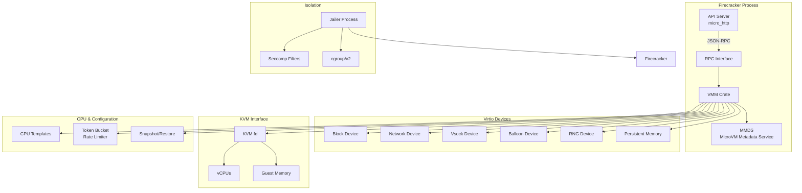

| Field | Value |
|---|---|
| **Origin** | [firecracker-microvm/firecracker](https://github.com/firecracker-microvm/firecracker) |
| **License** | Apache 2.0 |
| **Language** | Rust |
| **Type** | Virtual Machine Monitor (VMM) |
| **Source** | `sources/firecracker/` |
| **Built for** | AWS Lambda, AWS Fargate |

# Firecracker

**Firecracker** is an open-source Virtual Machine Monitor (VMM) built by Amazon Web Services to power **AWS Lambda** and **AWS Fargate**. It runs workloads in lightweight **microVMs** — combining the security of hardware virtualization with the speed and resource efficiency of containers. Firecracker uses **KVM** (Kernel-based Virtual Machine) on Linux and implements a minimal device model focused on serverless and container-based workloads.

## Architecture Overview



## Key Crates

Firecracker is organized as a Cargo workspace with the following primary crates:

| Crate | Path | Purpose |
|---|---|---|
| **firecracker** | `src/firecracker/` | Main binary — API server, entry point, capability-based seccomp |
| **vmm** | `src/vmm/` | Core VMM — KVM setup, vCPUs, memory, virtio devices, rate limiting, snapshot |
| **jailer** | `src/jailer/` | Separate binary for process isolation (namespaces, cgroups, chroot) |
| **seccompiler** | `src/seccompiler/` | Seccomp BPF filter generation at build time |
| **clippy-tracing** | `src/clippy-tracing/` | Tool to validate tracing coverage |
| **log-instrument** | `src/log-instrument/` | Procedural macro for automatic trace log instrumentation |
| **log-instrument-macros** | `src/log-instrument-macros/` | Macro implementation for log-instrument |
| **cpu-template-helper** | `src/cpu-template-helper/` | Tool for CPU template fingerprinting and customization |
| **rebase-snap** | `src/rebase-snap/` | Tool for rebasing diff snapshots onto full snapshots |
| **snapshot-editor** | `src/snapshot-editor/` | Tool for editing snapshot files |
| **acpi-tables** | `src/acpi-tables/` | ACPI table generation for x86_64 |
| **utils** | `src/utils/` | Shared utility code |

## Key Features

### MicroVM Sandbox (`src/vmm/`)

Firecracker implements a minimal VMM focused on the needs of serverless and containerized workloads. It boots Linux microVMs using KVM via `kvm-bindings` and `kvm-ioctls` crates. The device model is intentionally small — no emulated BIOS, no PCIe topology, no graphics — keeping attack surface minimal and boot times fast (<125ms).

### Jailer Isolation (`src/jailer/`)

The **Jailer** is a separate binary that sets up process isolation before launching the VMM. It creates a chroot jail, applies cgroup/v2 constraints, drops privileges, and joins new PID/net/mount namespaces. This prevents the VMM from accessing anything outside its jail.

### Seccomp Filtering (`src/seccomp/`)

Seccomp BPF (Berkeley Packet Filter) rules are applied at two levels:
- **VMM seccomp**: `vmm/src/seccomp.rs` — filters syscalls available to the VMM process
- **Build-time generation**: `src/seccompiler/` generates optimized BPF at compile time
- **Jailer seccomp**: Separate filter for the jailer binary

### Virtio Devices (`src/vmm/src/devices/virtio/`)

- **Block** (`devices/virtio/block/`) — Virtio block device with io_uring support and vhost-user
- **Net** (`devices/virtio/net/`) — Virtio network device backed by TAP interfaces
- **Vsock** (`devices/virtio/vsock/`) — VM sockets for host-guest communication
- **Balloon** (`devices/virtio/balloon/`) — Memory balloon for hotplug
- **RNG** (`devices/virtio/rng/`) — Entropy device
- **PMEM** (`devices/virtio/pmem/`) — Persistent memory device

### Rate Limiting (`src/vmm/src/rate_limiter/`)

Token-bucket rate limiters for I/O operations. Each device (block, net) can have independent bandwidth and ops rate limits configured via the API. The `TokenBucket` struct (`rate_limiter/mod.rs:56`) implements a token bucket algorithm with configurable size, refill rate, and burst capacity.

### Snapshot/Restore (`src/vmm/src/snapshot/`)

Full microVM snapshot and restore capability. A running microVM can be paused, serialized to disk, and later resumed — enabling fast scale-out and pre-warming. Supports both full snapshots and diff snapshots (incremental changes since a base).

### CPU Configuration (`src/vmm/src/cpu_config/`)

CPU templates allow customizing the CPU features exposed to guests. Supports both x86_64 and aarch64 templates, along with CPU template fingerprinting for identifying host CPU capabilities.

### MicroVM Metadata Service (MMDS)

A lightweight metadata service (`src/vmm/src/mmds/`) accessible from within the guest via the link-local address `169.254.169.254`, matching the AWS EC2 metadata API pattern. Allows injecting configuration and metadata into microVMs at boot.

## Built for Serverless

Firecracker powers two of AWS's largest serverless services:

- **AWS Lambda** — Runs function code in microVMs, providing strong isolation between tenants
- **AWS Fargate** — Runs containers in microVMs, combining the ergonomics of container orchestration with hardware virtualization

The security model is defense-in-depth: Jailer + seccomp + cgroups + minimal device model + KVM isolation.

## Requirements

- **Linux** with **KVM** support (`/dev/kvm` device)
- **x86_64** or **aarch64** architecture
- Linux kernel ≥ 4.14
- Root or access to `/dev/kvm`

## Build System

The `tools/devtool` script provides a Docker-based development environment:

```bash
./tools/devtool build          # Build binaries
./tools/devtool test           # Run test suite
./tools/devtool shell          # Interactive container shell
```

Build artifacts appear under `build/`. The devtool handles all toolchain and cross-compilation complexity.

## Cross-References

- [[kata-containers]] — Alternative microVM runtime using Firecracker and QEMU, integrates with Kubernetes via containerd
- [[flintlock]] — MicroVM lifecycle management service that uses Firecracker as its VM backend
- [[agentfield]] — Firecracker micro-VM platform for multi-agent AI deployments
- [[crun-vm]] — OCI runtime that can launch Firecracker microVMs from container images
- [[bootc]] — Bootable container technology that can run inside Firecracker microVMs

## Related

- [[deployment-architecture]] — Defense-in-depth architecture Firecracker exemplifies
- [[seccomp]] — Seccomp BPF security filtering (domain concept)
- [[kvm]] — KVM virtualization technology
- [[virtio]] — Virtio device standard

## Source

Full reference documentation at [firecracker-microvm.github.io](https://firecracker-microvm.github.io/).

- `sources/firecracker/` — Full source clone
- `sources/firecracker/SPECIFICATION.md` — API and design specification
- `sources/firecracker/docs/` — Documentation directory
