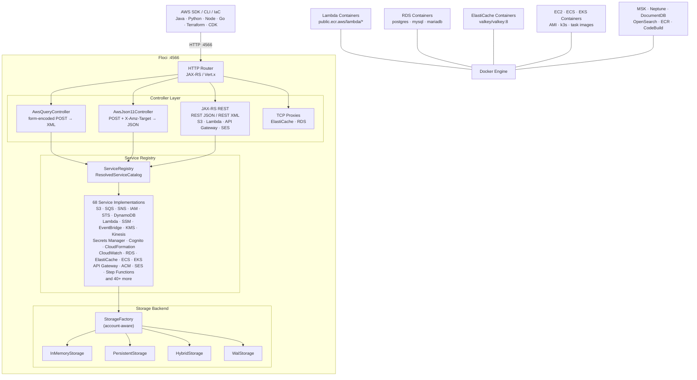

# Floci

**Source:** `sources/floci/`

Floci is a free, open-source local AWS emulator for development, testing, and CI. Built on [[Quarkus]] (Java 25), it provides AWS-shaped services on your machine without requiring a cloud account, auth token, or paid feature gates. Named after [floccus](https://en.wikipedia.org/wiki/Cirrocumulus_floccus), the popcorn-shaped cloud formation.

| Field | Value |
|---|---|
| **Origin** | [floci-io/floci](https://github.com/floci-io/floci) |
| **License** | MIT |
| **Stack** | Java 25, Quarkus 3.36.3, Jackson, RESTEasy Reactive, Docker |
| **Port** | 4566 |
| **CLI** | [floci-cli](https://github.com/floci-io/floci-cli) (separate repo) |
| **Docs** | https://floci.io/floci/ |
| **Docker** | `floci/floci:latest` |
| **Source** | `sources/floci/` |
| **Raw** | `raw/floci/` |
| **Codegraph** | `graphs/floci/` |

## What it is

Floci acts as a drop-in replacement for [[localstack]] Community (which sunset in March 2026). Point your AWS SDK, CLI, Terraform, CDK, [[opentofu]], or test suite at `http://localhost:4566` and keep your existing workflows — no account, no auth token, no feature gates.

| Capability | Floci | LocalStack Community |
|---|---|---|
| Auth token required | No | Yes |
| Security updates | Yes | Frozen |
| Startup time | ~24 ms | ~3.3 s |
| Idle memory | ~13 MiB | ~143 MiB |
| Docker image size | ~90 MB | ~1.0 GB |
| Native binary | ~40 MB | No |
| License | MIT | Restricted |

## Architecture

Floci follows a layered design with AWS wire protocol dispatchers at the top, routing to service handlers backed by a configurable storage abstraction.



### Controller types

| Controller | Protocol | Input | Output | Services |
|---|---|---|---|---|
| `AwsQueryController` | Query | `form-encoded POST` + `Action` | XML | SQS, SNS, IAM, STS, SES, RDS, ElastiCache, CloudFormation, CloudWatch Metrics, EC2, ELB v2, Auto Scaling, Elastic Beanstalk |
| `AwsJson11Controller` | JSON 1.1 | `POST` + `X-Amz-Target` | JSON | SSM, EventBridge, CloudWatch Logs, KMS, Kinesis, Cognito, Secrets Manager, ACM, ECS, ECR, Glue, Athena, Firehose, and 25+ more |
| `AwsJsonCborController` | JSON/CBOR | binary CBOR | JSON/CBOR | DynamoDB (via Smithy RPC v2) |
| JAX-RS | REST JSON/XML | REST paths | JSON/XML | S3, Lambda, API Gateway, SES v2, Lambda URL invocation |
| TCP proxies | ElastiCache RESP, RDS JDBC | raw TCP | native | ElastiCache (Redis/Valkey), RDS (PostgreSQL/MySQL/MariaDB), Neptune |

## Supported Services

Floci supports **69 AWS services** across categories. In-process services run directly inside the emulator; Docker-backed services launch real containers for high-fidelity emulation.

### Core services (in-process)

| Service | How it works | Key features |
|---|---|---|
| S3 | In-process | Versioning, multipart upload, pre-signed URLs, Object Lock, event notifications |
| SQS | In-process | Standard and FIFO queues, DLQ, visibility timeout, batch operations, tagging |
| SNS | In-process | Topics, subscriptions, SQS/Lambda/HTTP delivery, tagging |
| DynamoDB | In-process | GSI, LSI, Query, Scan, TTL, transactions, batch operations; Streams with Lambda event source mapping |
| IAM | In-process | Users, roles, groups, policies, instance profiles, access keys |
| STS | In-process | AssumeRole, WebIdentity, SAML, GetFederationToken, GetSessionToken |
| SSM | In-process + EC2 containers | Parameter Store (version history, labels, SecureString, tagging); Run Command |
| KMS | In-process | Encrypt, decrypt, sign, verify, data keys, aliases |
| Secrets Manager | In-process | Versioning, resource policies, tagging |
| Cognito | In-process | User pools, app clients, auth flows, JWKS and OpenID well-known endpoints |
| CloudFormation | In-process | Stacks, change sets, resource provisioning, StackSets |
| EventBridge | In-process | Custom buses, rules, SQS/SNS/Lambda targets |
| CloudWatch Logs | In-process | Log groups, streams, ingestion, filtering |
| CloudWatch Metrics | In-process | Custom metrics, statistics, alarms |
| API Gateway REST | In-process | Resources, methods, stages, Lambda proxy, MOCK/AWS integrations |
| API Gateway v2 | In-process | HTTP APIs, routes, integrations, JWT authorizers |
| Step Functions | In-process | ASL execution, task tokens, execution history |
| SES | In-process | v1 and v2 APIs: send email, raw email, DKIM, templates, configuration sets |
| ACM | In-process | Certificate issuance and validation lifecycle |
| Kinesis | In-process | Streams, shards, enhanced fan-out, split and merge |
| Route53 | In-process | Hosted zones, resource record sets, change tracking |
| EventBridge Pipes | In-process | Poller-based integration connecting SQS, Kinesis, DynamoDB, MSK sources |
| EventBridge Scheduler | In-process | Schedule groups, flexible time windows, retry policies, DLQs |
| AppSync | In-process | GraphQL API management, schema registry, channel namespaces |
| AppConfig / AppConfigData | In-process | Applications, environments, profiles, hosted versions, deployments |
| Athena | In-process with DuckDB sidecar | Real SQL execution over S3 and Glue-backed views |
| Glue | In-process | Data Catalog, Schema Registry |
| EMR | In-process | Cluster lifecycle, instance groups, steps, security configurations |
| WAF v2 | In-process | Web ACLs, IP sets, regex pattern sets, rule groups, logging |
| CloudFront | In-process | Distributions, origins, cache behaviors, invalidations |
| CloudTrail | In-process | Trail lifecycle, event selectors, logging status |
| Config | In-process | Config rules, configuration recorders, delivery channels |
| S3 Vectors | In-process | Vector buckets, indexes, cosine similarity queries |
| Textract | In-process stub | API-compatible stubs, dummy block data |
| Transcribe | In-process stub | Transcription jobs, custom vocabularies |
| Bedrock Runtime | In-process stub | Dummy Converse and InvokeModel responses |
| Auto Scaling | In-process | Launch configs, ASGs, lifecycle hooks |
| ELB v2 | In-process | ALB, NLB, target groups, listeners, routing rules |
| Elastic Beanstalk | In-process | Applications, versions, environments |
| Lightsail | In-process | Instances, disks, static IPs, key pairs |
| ECR | In-process with real registry | Repositories, docker push/pull |
| Resource Groups Tagging API | In-process | GetResources, tag/untag resources |
| CodePipeline | In-process | Pipelines, executions, S3 artifacts, approvals |
| CodeDeploy | In-process | Deployment groups, lifecycle hooks, auto-rollback |
| AWS Backup | In-process | Vaults, backup plans, simulated job lifecycle |
| Pricing | In-process with static snapshot | Product discovery, attributes |
| Cost Explorer | In-process | Cost synthesized from resource state |
| Cost and Usage Reports | In-process with floci-duck sidecar | CUR 2.0, FOCUS 1.2, Parquet emission |
| BCM Data Exports | In-process | Export lifecycle, executions |
| Cloud Control API | In-process | CRUD operations on AWS resource types |
| Cloud Map | In-process | HTTP/DNS namespaces, service discovery |
| IoT Core | In-process | Device management |
| Transfer Family | In-process | Server lifecycle, user management |
| Amazon MQ (control) | In-process | Broker configuration |
| CodeBuild | In-process with real Docker | Real buildspec execution, CloudWatch logs, S3 artifacts |
| AWS Batch | In-process | Compute environments, job queues, job definitions |
| MemoryDB (control) | In-process | Redis/Valkey protocol via real containers |
| Data Firehose | In-process | Streaming delivery, NDJSON flush to S3 |

### Docker-backed services (real containers)

| Service | Default Image | What runs |
|---|---|---|
| Lambda | `public.ecr.aws/lambda/<runtime>` | AWS runtime environment, warm container pool (`services/lambda/WarmPool.java`: containers reused across invocations, idle-evicted after `container-idle-timeout-seconds`; `FLOCI_SERVICES_LAMBDA_EPHEMERAL=true` disables reuse; hot-reload bucket bind-mounts code updates) |
| RDS | `postgres:16-alpine`, `mysql:8.0`, `mariadb:11` | PostgreSQL, MySQL, MariaDB engines |
| ElastiCache | `valkey/valkey:8` | Redis/Valkey protocol, IAM/SigV4 auth |
| Neptune | `tinkerpop/gremlin-server:3.7.3` | Gremlin WebSocket on port 8182 |
| DocumentDB | `mongo:7.0` | MongoDB wire protocol on port 27017 |
| MSK | `redpandadata/redpanda:latest` | Kafka-compatible broker |
| Amazon MQ | `rabbitmq:3-management` | RabbitMQ broker, AMQP |
| ECS | User-specified task image | Container lifecycle |
| EC2 | AMI-mapped Linux images | Linux containers, SSH key injection |
| EKS | `rancher/k3s:latest` | Kubernetes API server via k3s |
| OpenSearch | `opensearchproject/opensearch:2` | Full OpenSearch engine |
| CodeBuild | User-specified image | Buildspec execution |

## AWS Protocol Compatibility

Floci implements real AWS wire protocols — not convenience APIs — ensuring compatibility with the full ecosystem of AWS tooling.

| Protocol | Implementation | Services |
|---|---|---|
| **Query** | `AwsQueryController` → per-service `*QueryHandler` | SQS, SNS, IAM, STS, SES, RDS, ElastiCache, CloudFormation, CloudWatch Metrics, EC2, ELB v2, Auto Scaling, Elastic Beanstalk |
| **JSON 1.1** | `AwsJson11Controller` → per-service `*JsonHandler` | SSM, EventBridge, CloudWatch Logs, Cloud Map, EMR, KMS, Kinesis, Cognito, Secrets Manager, ACM, ECS, ECR, Glue, Athena, Firehose, Resource Groups Tagging, CodeBuild, CodeDeploy, CodePipeline, Transfer, Textract, Transcribe, Pricing, Cost Explorer, Config, CloudTrail, Lightsail, Cloud Control, WAF v2, MemoryDB |
| **REST JSON** | JAX-RS controllers | Lambda (management), API Gateway v2, SES v2, Bedrock Runtime |
| **REST XML** | JAX-RS `S3Controller` | S3, S3 Control |
| **TCP** | TCP proxy containers | ElastiCache (RESP), RDS (JDBC), Neptune (Gremlin WebSocket) |

## TLS Proxy Mode

Floci can serve **HTTP and HTTPS on the same port 4566** (LocalStack parity), enabled via `FLOCI_TLS_ENABLED` (default `false`):

- `config/TlsProxyServer.java` — a Vert.x TCP proxy listens on the public port (4566) and **sniffs the first byte** of each incoming connection to decide the backend:
  - `0x16` (TLS ClientHello) → proxy to the HTTPS backend on internal port 4511
  - anything else → proxy to the HTTP backend on internal port 4510
- When TLS is disabled, Quarkus serves HTTP directly on 4566 and the proxy is not started.
- Related config: `FLOCI_TLS_CERT_PATH`, `FLOCI_TLS_KEY_PATH`, `FLOCI_TLS_SELF_SIGNED` (auto-generate a cert), and `FLOCI_TLS_AWS_HTTPS_PORT` (also bind 443 so AWS-on-443 callbacks like CDK cfn-response reach Floci).

## Configuration Surface (`FLOCI_*`)

All settings are overridable via `FLOCI_` environment variables, resolved from `EmulatorConfig.java` (1645 lines) + `application.yml`. Notable groups beyond the basics (`FLOCI_PORT`, `FLOCI_STORAGE_MODE`, `FLOCI_DEFAULT_REGION`, `FLOCI_DEFAULT_ACCOUNT_ID`):

- **`FLOCI_SERVICES_*`** — per-service configuration:
  - `FLOCI_SERVICES_LAMBDA_DOCKER_NETWORK` — Docker network for Lambda containers
  - `FLOCI_SERVICES_<SVC>_DEFAULT_IMAGE` — override default container images (ElastiCache, RDS postgres/mysql/mariadb, MSK, OpenSearch, Neptune/Neo4j, DocDB, EKS, ECR registry)
  - `FLOCI_SERVICES_RDS_...` — RDS mock mode (`FLOCI_SERVICES_RDS_MOCK`) and proxy base ports
  - Lambda hot reload: the magic bucket name `hot-reload` triggers a bind-mount of function code into warm containers (`EmulatorConfig.java:1365-1378`)
  - Per-service `dockerNetwork` overrides (EmulatorConfig `Optional<String> dockerNetwork()`)
- **Proxy base ports** (`application.yml`): ElastiCache 6379, MemoryDB 6400, RDS 7001, Neptune 8182, OpenSearch 9400 (ranges 6379-6399 / 7001-7099 / 9200-9299 in docker-compose).
- **Region resolution** — `core/common/RegionResolver.java` maps any requested region to the emulator (any region works; default `us-east-1`).
- **Migration parity** — `LOCALSTACK_HOST`, `PERSISTENCE=1`, `LAMBDA_DOCKER_NETWORK`, `LAMBDA_REMOVE_CONTAINERS`, `DEBUG=1` translate automatically (README.md:702-712).

## Admin & State Management Endpoints

Under the `/_floci|/_localstack` prefix (`lifecycle/EmulatorInfoController.java`):

| Endpoint | Purpose |
|---|---|
| `/_floci/health` | Health check (LocalStack parity) |
| `/_floci/info` | Emulator info |
| `/_floci/init` | Initialization-hook status (boot.d/start.d/ready.d/stop.d) |
| `/_floci/diagnose` | Diagnostics |
| `/_floci/config` | Effective configuration |
| `/_floci/state/reset` | Reset emulator state |
| `/_floci/state/nuke` | Nuke all state |
| `/_floci/ecr/gc` | **Admin endpoint** (`services/ecr/registry/EcrGcController.java`) — triggers garbage collection on the backing `registry:2` container to reclaim disk after `BatchDeleteImage` |
| `/_floci/ui` | Web management UI (`lifecycle/UiController.java`) |

## Docker Image Build Layout

The official images are built from `docker/`:

- `docker/Dockerfile` — standard runtime image
- `docker/Dockerfile.compat` — includes AWS CLI + boto3 (`-compat` tags)
- `docker/Dockerfile.native` + `docker/Dockerfile.native-package` — GraalVM native binary builds
- `docker/entrypoint.sh` — container entrypoint; `docker/localstack-parity.sh` — LocalStack env translation
- Channels/tags: `latest`, `x.y.z`, `nightly`, `nightly-mmddyyyy`, each with `-compat` variants (README.md:716-741)

## Documentation Site

The docs site (https://floci.io/floci/) is built with **MkDocs** from the in-repo `docs/` directory: `mkdocs.yml` + `docs/` (getting-started, services, configuration, testcontainers, contributing).

## Storage

Floci provides four storage modes to trade speed for durability. Configured via `FLOCI_STORAGE_MODE` or per-service.

| Mode | Behavior | Best for | Durability |
|---|---|---|---|
| `memory` | Entirely in RAM, lost on container stop | CI and ephemeral tests | None |
| `persistent` | Loaded at startup, flushed to disk on every write | Simple local state preservation | Medium |
| `hybrid` | In-memory performance with periodic async flushing (5s interval) | Local development | Good |
| `wal` | Write-ahead log — every mutation logged before responding | Maximum durability | Highest |

The `StorageFactory` (`io.github.hectorvent.floci.core.storage.StorageFactory`) creates account-aware backends wrapping the underlying storage modes. Every backend is namespaced by the calling credential's account ID for multi-account isolation.

## SDK & Tool Compatibility

Point any AWS-compatible tool at `http://localhost:4566`:

| SDK / Tool | Configuration |
|---|---|
| **AWS SDK for Java v2** | `endpointOverride(URI.create("http://localhost:4566"))` |
| **boto3 (Python)** | `endpoint_url="http://localhost:4566"` |
| **AWS SDK for JavaScript v3** | `endpoint: "http://localhost:4566"` |
| **AWS SDK for Go v2** | `config.WithBaseEndpoint("http://localhost:4566")` |
| **AWS SDK for Rust** | `endpoint_url("http://localhost:4566")` |
| **AWS CLI** | `--endpoint-url http://localhost:4566` |
| **Terraform** | `endpoint` provider configuration |
| **OpenTofu** | `endpoint` provider configuration |
| **AWS CDK** | CDK CLI endpoint configuration |

### Compatibility test suite

The `compatibility-tests/` directory contains **2,506 automated tests** validating Floci against real SDKs and IaC tools:

| Module | Tests | Tooling |
|---|---|---|
| `sdk-test-java` | 1,326 | AWS SDK for Java v2, JUnit 5 |
| `sdk-test-node` | 449 | AWS SDK for JavaScript v3, vitest |
| `sdk-test-python` | 311 | boto3, pytest |
| `sdk-test-go` | 157 | AWS SDK for Go v2, go test |
| `sdk-test-awscli` | 205 | AWS CLI v2, bats-core |
| `compat-terraform` | 22 | Terraform v1.10+ |
| `compat-opentofu` | 16 | OpenTofu v1.9+ |
| `compat-cdk` | 20 | AWS CDK v2+ |

### Testcontainers modules

Floci has Testcontainers modules for starting isolated instances directly from tests:

| Language | Package |
|---|---|
| Java | `io.floci:testcontainers-floci` (Maven Central) |
| Node.js | `@floci/testcontainers` (npm) |
| Python | `testcontainers-floci` (PyPI) |

## Deployment

### Docker Compose

```yaml
services:
  floci:
    image: floci/floci:latest
    ports:
      - "4566:4566"
    volumes:
      - /var/run/docker.sock:/var/run/docker.sock
    environment:
      - FLOCI_STORAGE_MODE=hybrid
```

The official Docker image exposes port 4566, plus port ranges for proxied services (6379-6399 for ElastiCache, 7001-7099 for RDS, 9200-9299 for OpenSearch).

### CLI

The [floci-cli](https://github.com/floci-io/floci-cli) (separate repo) provides:
- `floci start` — starts the emulator
- `floci env` — exports AWS environment variables pointing to the local instance
- `floci stop` — stops the emulator

## Key Observability

- **Health endpoint**: `/_localstack/health` (LocalStack parity)
- **Emulator info**: `/_floci/info`
- **Web UI**: Built-in management interface at `/_floci/ui`
- **Logs**: Structured JBoss Logging with configurable levels

## Source Reference

- **POM**: `pom.xml` (lines 7-14) — `io.github.hectorvent:floci:1.5.34`, Quarkus 3.36.3 parent
- **Config**: `EmulatorConfig.java` (1645 lines) — All `floci.*` configuration options
- **Storage factory**: `core/storage/StorageFactory.java` (145 lines) — Creates memory/persistent/hybrid/WAL backends
- **Query controller**: `core/common/AwsQueryController.java` (496 lines) — Routes Query-protocol services via handlers
- **JSON 1.1 controller**: `core/common/AwsJson11Controller.java` (260 lines) — Routes JSON 1.1 services via handlers
- **Error handling**: `core/common/AwsException.java` (72 lines) + `AwsExceptionMapper.java` (46 lines) — Standardized AWS error responses
- **Service registry**: `core/common/ServiceRegistry.java` (61 lines) — Enabled/disabled service management
- **Lambda executor**: `services/lambda/LambdaExecutorService.java` (140 lines) — Orchestrates Docker-backed function invocations
- **Warm pool**: `services/lambda/WarmPool.java` — Manages warm Lambda containers
- **Docker launcher**: `services/lambda/launcher/ContainerLauncher.java` — Uses docker-java API for container lifecycle
- **Compatibility tests**: `compatibility-tests/` — 2,506 tests across 8 modules

## See also

- [[opentofu]] — Open-source IaC alternative, compatible with Floci
- [[agentfield]] — Multi-agent platform (Floci is a different type of project)
- [[pi]] — TypeScript agent harness
