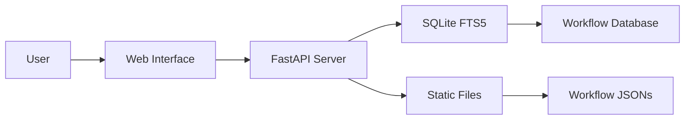

# n8n Workflows

A community-maintained repository containing one of the largest collections of n8n automation workflows available. This catalog serves as both a production-ready workflow library and a reference corpus for understanding integration patterns across 365+ services.

## Overview

[n8n](https://n8n.io/) is a fair-code, extensible workflow automation tool that connects services through a visual node-based interface. Each workflow is stored as a JSON file containing node definitions, connections, and configurations. This repository provides:

- **4,343** production-ready workflow JSON definitions
- **365+** unique service integrations
- **188** category subdirectories organized by integration type
- **87** distinct trigger types for workflow initiation
- **29,445** total nodes across all workflows (avg ~14.9 nodes/workflow)

## Key Features

### By The Numbers
| Metric | Value |
|---|---|
| Total workflows | 4,343 |
| Active workflows | 4,343 |
| Unique integrations | 365+ |
| Category directories | 188 |
| Total nodes | 29,445 |
| Trigger types | 87 |

### Performance
- **< 100ms** search response time
- **SQLite FTS5** full-text search engine
- **GitHub Pages** live interface at [zie619.github.io/n8n-workflows](https://zie619.github.io/n8n-workflows)
- **Docker** multi-platform support (linux/amd64, linux/arm64)

## Architecture



### Tech Stack
- **Backend**: Python, FastAPI, SQLite with FTS5
- **Frontend**: Vanilla JS, Tailwind CSS
- **Database**: SQLite with Full-Text Search
- **Deployment**: Docker, GitHub Actions, GitHub Pages

## Source Structure

```
n8n-workflows/
├── workflows/              # 4,343 workflow JSON files
│   └── [category]/      # Organized by integration/service
├── src/                 # Python source modules
│   ├── ai_assistant.py
│   ├── analytics_engine.py
│   ├── community_features.py
│   ├── integration_hub.py
│   ├── performance_monitor.py
│   └── user_management.py
├── scripts/             # Utility scripts
│   ├── generate_search_index.py
│   ├── update_readme_stats.py
│   └── update_github_pages.py
├── api_server.py        # FastAPI application server
├── workflow_db.py       # Database manager
├── run.py             # Server launcher
└── docs/              # GitHub Pages site
```

## API Endpoints

| Endpoint | Method | Description |
|----------|--------|-------------|
| `/` | GET | Web interface |
| `/api/search` | GET | Search workflows |
| `/api/stats` | GET | Repository statistics |
| `/api/workflow/{id}` | GET | Get workflow JSON |
| `/api/categories` | GET | List all categories |
| `/api/export` | GET | Export workflows |

## Workflow Patterns

The catalog reveals common integration patterns:

### Data Pipeline
`Trigger → Fetch Data → Transform → Store/Send` — Webhook or schedule triggers initiate data retrieval, followed by transformation and delivery to target systems.

### Integration Sync
`Schedule → API Call → Compare → Update Systems` — Periodic polling of APIs to synchronize data across services.

### Automation
`Webhook → Process → Conditional Logic → Actions` — Event-driven processing with branching logic.

### AI Agent
`AI Agent → Tool → Action` — Natural-language-driven automation using LangChain/openAI nodes with tool sub-nodes (Gmail, Calendar, Database).

## Top Categories

| Category | Workflows | Primary Integrations |
|----------|-----------|-------------------|
| Manual | 391 | manualTrigger, webhook, schedule |
| Splitout | 194 | splitOut, aggregate, if, merge |
| Code | 183 | code, function, httpRequest |
| Http | 176 | Various integration triggers |
| Telegram | 119 | telegramTrigger, telegram |
| Webhook | 65 | webhook, respondToWebhook |

### Trigger Types (High Volume)
- `manualTrigger` — 927 workflows
- `webhook` — 313 workflows
- `scheduleTrigger` — 311 workflows
- `telegramTrigger` — 94 workflows
- `gmailTrigger` — 53 workflows

## File Naming Convention

Workflow filenames follow the pattern: `[ID]_[Description]_[TriggerType].json`

Example: `9001_Scalable_Webhook_Orchestrator_Webhook.json`

- **ID**: Sequential number
- **Description**: Workflow purpose
- **TriggerType**: Primary trigger (Webhook, Manual, Schedule, etc.)

## Asset Catalog

See [[n8n-workflow-catalog]] for detailed statistics and category breakdowns of all workflows organized by integration.

## Related Resources

- **Live Interface**: [zie619.github.io/n8n-workflows](https://zie619.github.io/n8n-workflows)
- **Source Repository**: `/sources/n8n-workflows`
- **Category Catalog**: [[n8n-workflow-catalog]]