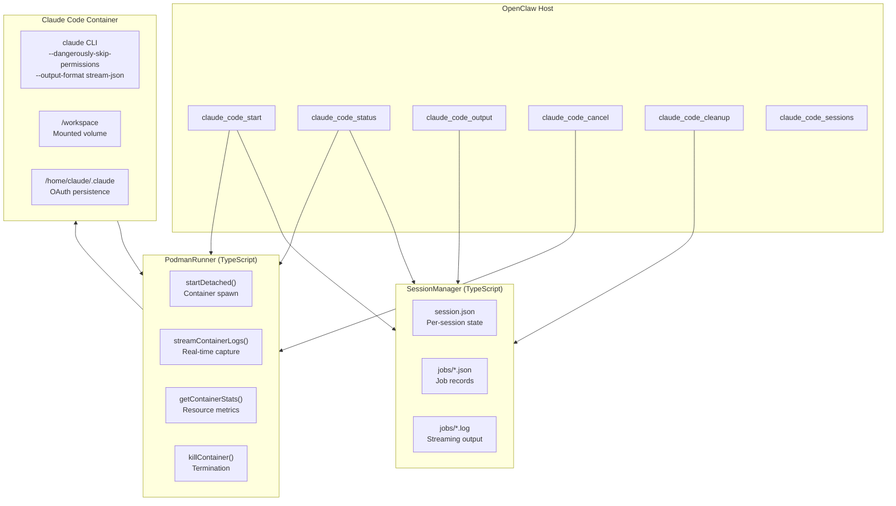

# OpenClaw Plugin: Claude Code

**Package:** `@13rac1/openclaw-plugin-claude-code`  
**Version:** 1.1.0  
**Source:** `sources/openclaw-plugin-claude-code/`

An OpenClaw plugin that executes Claude Code CLI sessions in rootless Podman containers with secure isolation, session persistence, and real-time streaming output.

## Purpose

This plugin enables OpenClaw agents to delegate coding tasks to Claude Code while maintaining strong security boundaries. It addresses the critical tension between Claude Code's `--dangerously-skip-permissions` mode (necessary for autonomous operation) and the need to contain AI-generated code execution.

## Key Features

| Feature | Description |
|---------|-------------|
| **Rootless Containers** | Podman rootless by default (no daemon, no root process) |
| **Capability Dropping** | `--cap-drop ALL` removes all Linux capabilities |
| **Resource Limits** | Configurable memory (default 2GB), CPU, PID limits |
| **Session Persistence** | Claude Code session IDs captured and reused for multi-turn workflows |
| **Real-time Streaming** | Output captured via `stream-json` format as it's generated |
| **Webhook Notifications** | Jobs push completion events (no polling required) |
| **Dual Auth Support** | OAuth/Claude Max credentials (via mounted `~/.claude`) or API key |

## Architecture



## Tool Interface

### `claude_code_start`

Start a Claude Code task in the background. Returns immediately with a job ID.

**Parameters:**
- `prompt` (required): The task or prompt to send to Claude Code
- `session_id` (optional): Session ID to continue a previous session

**Returns:** `{ jobId, sessionKey, status, message }`

### `claude_code_status`

Check the status of a running or completed job.

**Returns:**
- `status`: pending | running | completed | failed | cancelled
- `elapsedSeconds`: Time since job started
- `outputSize`: Total output size in bytes
- `tailOutput`: Last ~500 chars of output
- `lastOutputSecondsAgo`: Seconds since last output
- `activityState`: active (producing output), processing (CPU busy), or idle
- `metrics`: CPU and memory usage
- `exitCode`: Process exit code (when completed)
- `error`: Error message (if failed)

### `claude_code_output`

Read or tail output from a job (supports pagination while running).

**Parameters:**
- `job_id` (required): Job ID
- `session_id` (optional): Session ID
- `offset` (optional): Byte offset to start reading from
- `limit` (optional): Maximum bytes to read (default 64KB)

**Returns:** Output content with `hasMore` flag for pagination

### `claude_code_cancel`

Cancel a running job and stop its container.

### `claude_code_cleanup`

Clean up idle sessions. By default preserves workspace data; use `delete_workspaces: true` to also remove code/workspace.

### `claude_code_sessions`

List all active sessions with age, last activity, message count, and active job info.

## Configuration

```json
{
  "plugins": {
    "enabled": true,
    "load": {
      "paths": ["path/to/dist/index.js"]
    },
    "entries": {
      "claude-code": {
        "enabled": true,
        "config": {
          "image": "ghcr.io/13rac1/openclaw-claude-code:latest",
          "runtime": "podman",
          "startupTimeout": 30,
          "idleTimeout": 120,
          "memory": "2g",
          "cpus": "1.0",
          "network": "bridge",
          "sessionsDir": "~/.openclaw/claude-sessions",
          "workspacesDir": "~/.openclaw/workspaces",
          "sessionIdleTimeout": 3600,
          "apparmorProfile": "",
          "maxOutputSize": 10485760,
          "notifyWebhookUrl": "http://localhost:18789/hooks/agent",
          "hooksToken": ""
        }
      }
    }
  }
}
```

| Option | Default | Description |
|--------|---------|-------------|
| `image` | `ghcr.io/13rac1/openclaw-claude-code:latest` | Container image |
| `runtime` | `podman` | Container runtime (podman or docker) |
| `startupTimeout` | 30 | Seconds to wait for first output |
| `idleTimeout` | 120 | Kill container after no output (hung detection) |
| `memory` | `2g` | Memory limit |
| `cpus` | `1.0` | CPU limit |
| `network` | `bridge` | Network mode (none, bridge, host) |
| `sessionIdleTimeout` | 3600 | Cleanup idle sessions after seconds |
| `apparmorProfile` | `""` | AppArmor profile name (empty = disabled) |
| `maxOutputSize` | 10485760 | Maximum output size (0 = unlimited) |

## Security Model

The plugin implements defense-in-depth through multiple layers:

| Layer | Implementation |
|-------|----------------|
| **Rootless Containers** | Podman runs without daemon or root process |
| **Capability Dropping** | `--cap-drop ALL` removes all capabilities |
| **Resource Limits** | Memory, CPU, and PID limits prevent exhaustion |
| **tmpfs** | `/tmp` mounted as tmpfs with `nosuid` (512MB, exec allowed) |
| **Network Isolation** | Configurable network mode (default `bridge`, can be `none`) |
| **AppArmor** | Optional MAC profile support |

If an AI agent escapes the container, it lands in an unprivileged user namespace with no capabilities.

## Session Persistence

Each session maintains:
- Claude Code session ID (captured from stream output) for `--resume` support across multiple prompts
- Workspace directory mounted into container
- Job history for auditing
- OAuth credential persistence via direct `~/.claude` mount

## Webhook Notifications

When a job completes (success/failure/cancel), the plugin sends a POST to the configured webhook URL with:

```typescript
{
  jobId: string;
  sessionKey: string;
  status: "completed" | "failed" | "cancelled";
  elapsedSeconds: number;
  outputSize: number;
  exitCode: number | null;
  errorType: ErrorType | null; // crash, oom, rate_limit, auth_expired
}
```

## Relationship to OpenClaw

This plugin extends OpenClaw's capabilities by adding a **contained coding agent**. While OpenClaw's built-in `coding-agent` skill delegates via bash/process tools directly on the host, this plugin provides:

- Real containment for `--dangerously-skip-permissions` mode
- Persistent sessions that survive across interactions
- Structured job management with status, output pagination, activity detection
- Hard resource limits for untrusted code

## Relationship to Other Projects

| Project | Relationship |
|---------|--------------|
| [[openclaw]] | Core agent platform; this plugin implements the coding agent extension point |
| [[podman]] | Runtime for container isolation |
| [[buildah]] | Builds the container image (via `podman build` which delegates to Buildah) |
| [[hermes-agent]] | Alternative agent platform that could use this plugin pattern |
| [[nix-podman-stacks]] | Declarative container image management |
| [[n8n]] | Workflow automation that could trigger Claude Code via this plugin |

## Container Image

The included Dockerfile creates a Debian Bookworm-based image with:
- Node.js 22
- Claude Code CLI (global npm install)
- Go 1.22.5 + TinyGo 0.32.0
- Python 3 with venv
- Common dev tools: git, ripgrep, jq, curl

Build: `podman build -t ghcr.io/13rac1/openclaw-claude-code:latest .`

## Source Layout

| File | Purpose |
|------|---------|
| `src/claude-code.ts` | Main plugin entry point, tool registration |
| `src/session-manager.ts` | Session and job state management (JSON files) |
| `src/podman-runner.ts` | Podman CLI wrapper (spawn, stats, logs, lifecycle) |
| `src/stream-parser.ts` | JSON stream parsing for Claude Code output |
| `src/notification.ts` | Webhook POST for job completion |
| `src/format.ts` | Duration and byte formatting utilities |
| `src/test-harness.ts` | Test utilities for mocking |

## Authentication

Two methods supported:

1. **OAuth / Claude Max** (recommended): Place credentials at `~/.claude/.credentials.json`. The plugin mounts `~/.claude` into containers so token refreshes persist.

2. **API Key**: Set `ANTHROPIC_API_KEY` environment variable.

If both are available, OAuth takes precedence.

## Version History

| Version | Date | Key Changes |
|---------|------|-------------|
| 1.1.0 | 2026-04-05 | Capture session_id for resume; pass through proxy env vars; /tmp tmpfs changes |
| 1.0.12 | 2026-02-23 | Git identity injection; cleanup workspace preservation |
| 1.0.11 | 2026-02-20 | Auth/rate limit detection; real-time streaming; webhook notifications; sessions list |
| 1.0.0 | 2026-02-12 | Initial release |

## Installation

```bash
# From npm
openclaw plugins install @13rac1/openclaw-plugin-claude-code

# Or from GitHub release
unzip openclaw-plugin-claude-code-*.zip -d ~/.openclaw/plugins/openclaw-plugin-claude-code
```

Pull the container image:
```bash
podman pull ghcr.io/13rac1/openclaw-claude-code:latest
```

## Related

- [[openclaw]] — Core agent platform
- [[podman]] — Rootless container runtime
- [[buildah]] — Image builder (used by podman build)
- [[n8n]] — Workflow automation that can trigger Claude Code tasks
- [[nix-podman-stacks]] — Declarative container management